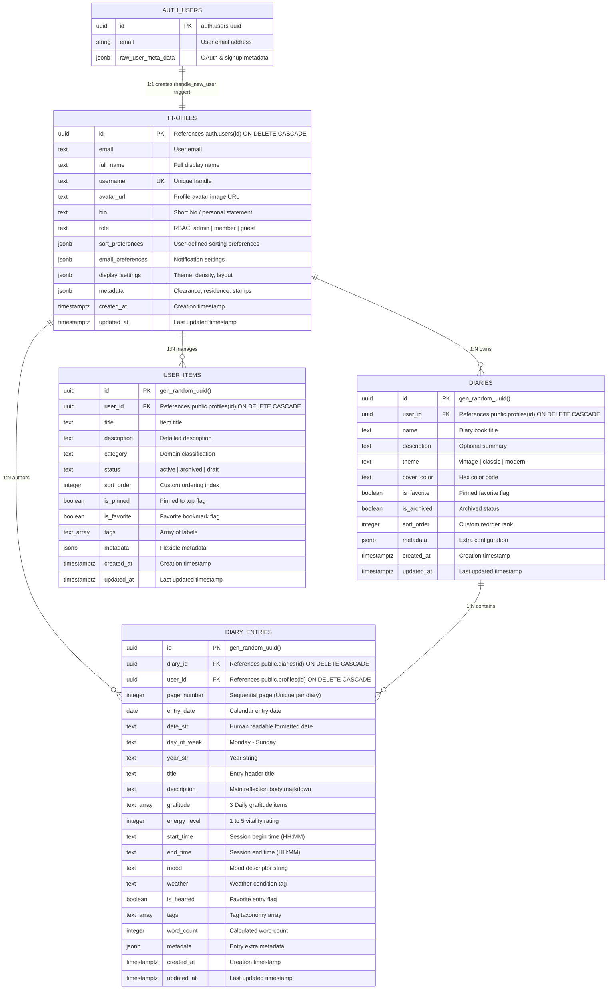

# Database Architecture & Entity Relationship Schema

> [!NOTE]
> This document details the PostgreSQL relational data model, table structures, foreign key relationships, indexes, and Row Level Security (RLS) constraints for **The Commons**.

---

## 1. Entity Relationship Diagram (ERD)

---

## 2. Table Specifications

### Table: `public.profiles`
Primary identity and citizen passport record extending Supabase `auth.users`.

| Column | Type | Nullable | Default / Constraint | Description |
| :--- | :--- | :--- | :--- | :--- |
| `id` | `uuid` | ❌ No | `PK -> auth.users.id ON DELETE CASCADE` | Unique user identity linked to auth |
| `email` | `text` | ❌ No | Unique | Primary contact email |
| `full_name` | `text` | ✅ Yes | `NULL` | Formatted user name |
| `username` | `text` | ✅ Yes | Unique | Handle for citations and mentions |
| `avatar_url` | `text` | ✅ Yes | `NULL` | Public avatar image URI |
| `bio` | `text` | ✅ Yes | `NULL` | Citizen bio or description |
| `role` | `text` | ❌ No | `'member' CHECK (role IN ('admin', 'member', 'guest'))` | Role-based permission tier |
| `sort_preferences` | `jsonb` | ❌ No | `{'default_sort_by': 'created_at', 'filter_favorites_first': true, ...}` | Custom column sort and pin orders |
| `email_preferences`| `jsonb` | ❌ No | `{'transactional': true, 'digest_frequency': 'weekly', ...}` | Communication settings |
| `display_settings` | `jsonb` | ❌ No | `{'theme': 'system', 'density': 'comfortable', ...}` | Client UI theme and layout settings |
| `metadata` | `jsonb` | ❌ No | `{'residence': 'Archival Broadside', 'clearance_title': 'Level II Scribe', ...}` | Unlocked stamps, residence, streaks |
| `created_at` | `timestamptz` | ❌ No | `now()` | Timestamp of profile registration |
| `updated_at` | `timestamptz` | ❌ No | `now()` | Last profile modification timestamp |

---

### Table: `public.diaries`
Journal collection entities owned by authenticated citizens.

| Column | Type | Nullable | Default / Constraint | Description |
| :--- | :--- | :--- | :--- | :--- |
| `id` | `uuid` | ❌ No | `gen_random_uuid() PK` | Primary key |
| `user_id` | `uuid` | ❌ No | `FK -> public.profiles(id) ON DELETE CASCADE` | Owning citizen user ID |
| `name` | `text` | ❌ No | — | Name / title of the diary book |
| `description` | `text` | ✅ Yes | `NULL` | Book prologue or description |
| `theme` | `text` | ❌ No | `'vintage' CHECK (theme IN ('vintage', 'classic', 'modern'))` | Visual skin and styling theme |
| `cover_color` | `text` | ✅ Yes | `'#8C3A27'` | Hex color accent for leather/spine |
| `is_favorite` | `boolean` | ❌ No | `false` | Pinned to dashboard favorites |
| `is_archived` | `boolean` | ❌ No | `false` | Soft archive flag |
| `sort_order` | `integer` | ❌ No | `0` | User manual drag-and-drop sort rank |
| `metadata` | `jsonb` | ❌ No | `'{}'::jsonb` | Extended properties and typography |
| `created_at` | `timestamptz` | ❌ No | `now()` | Creation timestamp |
| `updated_at` | `timestamptz` | ❌ No | `now()` | Last update timestamp |

---

### Table: `public.diary_entries`
Individual timestamped pages belonging to a specific diary.

| Column | Type | Nullable | Default / Constraint | Description |
| :--- | :--- | :--- | :--- | :--- |
| `id` | `uuid` | ❌ No | `gen_random_uuid() PK` | Entry primary identifier |
| `diary_id` | `uuid` | ❌ No | `FK -> public.diaries(id) ON DELETE CASCADE` | Parent diary container |
| `user_id` | `uuid` | ❌ No | `FK -> public.profiles(id) ON DELETE CASCADE` | Author user ID for RLS verification |
| `page_number` | `integer` | ❌ No | `1 (UNIQUE with diary_id)` | Sequential page index in book |
| `entry_date` | `date` | ❌ No | `current_date` | Real-world date of record |
| `date_str` | `text` | ❌ No | — | Pre-formatted display date (e.g. "September 17") |
| `day_of_week`| `text` | ❌ No | — | Day name (e.g. "Thursday") |
| `year_str` | `text` | ❌ No | — | Year string (e.g. "Anno 2026") |
| `title` | `text` | ❌ No | `''` | Entry headline title |
| `description`| `text` | ❌ No | `''` | Longform markdown journal text |
| `gratitude` | `text[]` | ❌ No | `array['', '', '']::text[]` | 3 Gratitude prompt statements |
| `energy_level`| `integer` | ❌ No | `3 CHECK (energy_level BETWEEN 1 AND 5)` | Vitality score (1=Lowest, 5=Peak) |
| `start_time` | `text` | ✅ Yes | `'09:00'` | Reflection start time |
| `end_time` | `text` | ✅ Yes | `'17:00'` | Reflection conclusion time |
| `mood` | `text` | ❌ No | `'🌿 Calm'` | Primary mood descriptor |
| `weather` | `text` | ❌ No | `'sunny'` | Weather icon identifier |
| `is_hearted` | `boolean` | ❌ No | `false` | Hearted memory bookmark |
| `tags` | `text[]` | ❌ No | `'{}'` | Categorical tags array |
| `word_count` | `integer` | ❌ No | `0` | Computed word count |
| `metadata` | `jsonb` | ❌ No | `'{}'::jsonb` | Rich media / attachments metadata |
| `created_at` | `timestamptz` | ❌ No | `now()` | Timestamp of page creation |
| `updated_at` | `timestamptz` | ❌ No | `now()` | Timestamp of last edit |

---

### Table: `public.user_items`
Generic sortable and pinnable entity showcase for citizen workspace modules.

| Column | Type | Nullable | Default / Constraint | Description |
| :--- | :--- | :--- | :--- | :--- |
| `id` | `uuid` | ❌ No | `gen_random_uuid() PK` | Unique item identifier |
| `user_id` | `uuid` | ❌ No | `FK -> public.profiles(id) ON DELETE CASCADE` | Scoped owner profile |
| `title` | `text` | ❌ No | — | Item headline |
| `description`| `text` | ✅ Yes | `NULL` | Rich text / markdown summary |
| `category` | `text` | ✅ Yes | `NULL` | Department / folder category |
| `status` | `text` | ❌ No | `'active' CHECK (status IN ('active', 'archived', 'draft'))` | Lifecycle status |
| `sort_order` | `integer` | ❌ No | `0` | Drag & drop sorting rank index |
| `is_pinned` | `boolean` | ❌ No | `false` | Sticky pinned item |
| `is_favorite`| `boolean` | ❌ No | `false` | Favorite status |
| `tags` | `text[]` | ❌ No | `'{}'` | Categorization tags |
| `metadata` | `jsonb` | ❌ No | `'{}'::jsonb` | Domain metadata |
| `created_at` | `timestamptz` | ❌ No | `now()` | Record creation timestamp |
| `updated_at` | `timestamptz` | ❌ No | `now()` | Record last modified timestamp |

---

## 3. Database Indexes & Query Optimizations

| Table | Index Name | Type / Columns | Target Query / Use Case |
| :--- | :--- | :--- | :--- |
| `public.profiles` | `idx_profiles_email` | B-tree (`email`) | Fast authentication and user lookups |
| `public.profiles` | `idx_profiles_role` | B-tree (`role`) | RBAC filtering and administrative scopes |
| `public.diaries` | `idx_diaries_user_sort` | B-tree (`user_id, is_favorite DESC, sort_order ASC, created_at DESC`) | Instant dashboard shelf and bookshelf rendering |
| `public.diaries` | `idx_diaries_user_archived` | B-tree (`user_id, is_archived`) | Archived vs active tome queries |
| `public.diary_entries` | `idx_diary_entries_diary_page` | B-tree (`diary_id, page_number DESC`) | Instant page flipping and book rendering |
| `public.diary_entries` | `idx_diary_entries_user_date` | B-tree (`user_id, entry_date DESC`) | Chronological timeline and streak calculations |
| `public.diary_entries` | `idx_diary_entries_user_hearted` | Partial B-tree (`user_id, is_hearted`) `WHERE is_hearted = true` | Hearted memory bookmarks lookup |
| `public.diary_entries` | `idx_diary_entries_tags` | GIN (`tags`) | Array membership `@>` queries for tag filters |
| `public.diary_entries` | `idx_diary_entries_mood` | B-tree (`user_id, mood`) | Mood analytics and filtering |
| `public.user_items` | `idx_user_items_user_order` | B-tree (`user_id, sort_order ASC`) | Fast sorted item collection loads |

---

## 4. Row Level Security (RLS) Matrix

| Table | Operation | Policy Rule | Logic |
| :--- | :--- | :--- | :--- |
| `public.profiles` | `SELECT` | Authenticated users | `auth.role() = 'authenticated'` |
| `public.profiles` | `UPDATE` | Self only (or Admin) | `auth.uid() = id` (or admin check) |
| `public.diaries` | `ALL` (`SELECT`, `INSERT`, `UPDATE`, `DELETE`) | Owner only | `auth.uid() = user_id` |
| `public.diary_entries` | `ALL` (`SELECT`, `INSERT`, `UPDATE`, `DELETE`) | Author only | `auth.uid() = user_id` |
| `public.user_items` | `ALL` (`SELECT`, `INSERT`, `UPDATE`, `DELETE`) | Owner only | `auth.uid() = user_id` |
