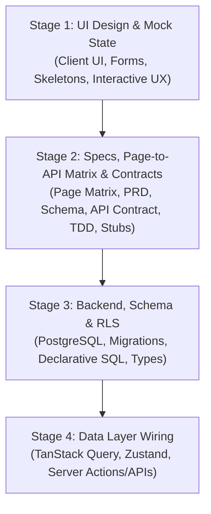

# Feature Development & Documentation Lifecycle

This document defines the standardized **UI-First (Outside-In)** feature engineering process and documentation structure for **The Commons**. Following this workflow ensures that AI coding agents and engineers build features predictably with zero schema drift, clear state boundaries, and reliable database contracts.

---

## 🔁 4-Stage Feature Development Process



### Stage 1: UI Design & Mock Implementation (Frontend First)
1. Build the page route (`src/app/...`) and component tree using local mock data.
2. Ensure all 4 core UI states are visually built:
   - **Active / Populated State**: Full data view.
   - **Loading State**: Skeleton loaders (no generic spinners).
   - **Empty State**: Contextual empty message + call-to-action (CTA).
   - **Error / Validation State**: Inline form errors + toast notifications.
3. Verify tactile styling and design token alignment.

### Stage 2: Feature Documentation & Contract Refinement
Once the UI layout and form requirements are validated in browser:
1. Create or update the feature folder under `docs/features/<feature-name>/` using the templates in `docs/features/_template/`.
2. Extract the exact data fields needed by the UI into `02-data-model.md`.
3. Document endpoints/actions in `03-api-contract.md`.
4. Map all UI actions to endpoints in `05-page-to-api-matrix.md`.
5. Define TypeScript interfaces and function stubs in `stubs.ts`.

### Stage 3: Backend, Database Schema & Security
1. Write declarative SQL schema in `supabase/schema/` (tables, RLS policies, indexes, triggers).
2. Generate migration or run local migration scripts (`pnpm supabase migration ...`).
3. Generate TypeScript types: `pnpm supabase gen types typescript --local > src/types/supabase.ts`.

### Stage 4: Wiring & Integration
1. Implement the API / Server Actions in `src/lib/api/` or Supabase RPCs.
2. Wrap queries and mutations with **TanStack Query (v5)** hooks.
3. Manage transient/client-only UI state with **Zustand (v5)**.
4. Replace mock UI data with query hooks and verify end-to-end flow.

---

## 📁 Feature Documentation Structure

Each feature or module maintains its own folder under `docs/features/<feature-name>/`:

```text
docs/features/<feature-name>/
├── 01-prd.md                # Product & UX requirements (What & Why)
├── 02-data-model.md         # SQL schemas, RLS policies, indexes & Zod validation
├── 03-api-contract.md       # Server Actions / REST endpoints, payloads, response shapes
├── 04-tdd.md                # Technical architecture, component mapping, state flow
├── 05-page-to-api-matrix.md # Page route to API/RPC and cache sync mapping
└── stubs.ts                 # Concrete TypeScript interfaces & stubbed functions
```

### Boilerplate Templates
Copy from `docs/features/_template/` when starting any new feature:
- [`01-prd.md`](file:///Users/daviditc/Documents/personal_projects/The-Commons/docs/features/_template/01-prd.md)
- [`02-data-model.md`](file:///Users/daviditc/Documents/personal_projects/The-Commons/docs/features/_template/02-data-model.md)
- [`03-api-contract.md`](file:///Users/daviditc/Documents/personal_projects/The-Commons/docs/features/_template/03-api-contract.md)
- [`04-tdd.md`](file:///Users/daviditc/Documents/personal_projects/The-Commons/docs/features/_template/04-tdd.md)
- [`05-page-to-api-matrix.md`](file:///Users/daviditc/Documents/personal_projects/The-Commons/docs/features/_template/05-page-to-api-matrix.md)
- [`stubs.ts`](file:///Users/daviditc/Documents/personal_projects/The-Commons/docs/features/_template/stubs.ts)
