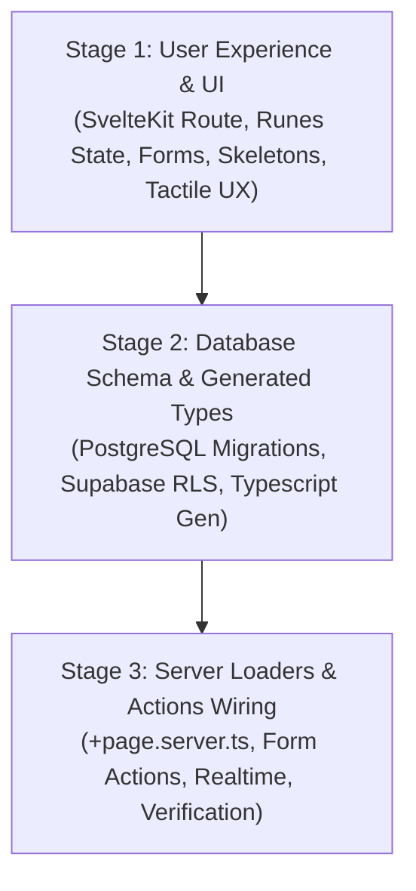

# Feature Development & Documentation Lifecycle

This document defines the practical, high-velocity engineering workflow for **The Commons**. Following this workflow ensures predictable feature delivery without documentation rot, context bloat, or schema drift.

---

## 🔁 3-Stage High-Velocity Feature Process


```mermaid
graph TD
    A["Stage 1: User Experience & UI<br/>(SvelteKit Route, Runes State, Forms, Skeletons, Tactile UX)"] --> B["Stage 2: Database Schema & Generated Types<br/>(PostgreSQL Migrations, Supabase RLS, Typescript Gen)"]
    B --> C["Stage 3: Server Loaders & Actions Wiring<br/>(+page.server.ts, Form Actions, Realtime, Verification)"]
```

### Stage 1: UI & Interaction Design (Frontend First)
1. Build or iterate on the page route (`src/routes/.../+page.svelte`) using Svelte 5 runes (`$state`, `$derived`, `$props`).
2. Implement core UI states:
   - **Active State**: Interactive data view.
   - **Loading / Skeleton State**: Clean layout skeletons (avoid generic spinners).
   - **Empty State**: Contextual empty state with quick action button.
   - **Validation / Error State**: Inline form errors and clean toasts.

### Stage 2: Database Schema & Auto-Generated Types
1. Write declarative SQL migration in `supabase/migrations/` (tables, foreign keys, indexes, RLS policies).
2. Apply migration locally or to remote project.
3. Automatically generate TypeScript types:
   ```bash
   npx supabase gen types typescript --local > src/lib/types/database.types.ts
   ```
4. Never manually type duplicate table schema definitions in markdown. Let the generated types be the ground truth.

### Stage 3: Server Data Wiring & Verification
1. Load server data directly in `+page.server.ts` or `+page.ts` using typed Supabase queries.
2. Implement mutations via SvelteKit **Form Actions** in `+page.server.ts` (or `+server.ts` for raw API endpoints).
3. Test end-to-end flows with real data and verify that RLS policies guard unauthorized access.

---

## 📁 Feature Documentation Guidelines

To keep velocity fast and avoid documentation rot, each feature folder under `docs/features/<feature-name>/` keeps **one unified spec** (instead of 5 fragmented documents):

```text
docs/features/<feature-name>/
└── spec.md         # Unified feature spec: User Story, Schema delta, Routes/Actions, & Checklist
```

### What Goes in `spec.md`:
1. **User Goal & UX**: What problem does this solve and what is the primary user interaction flow?
2. **Data & Schema**: Which database tables/columns are added or modified (SQL migration draft).
3. **Route & Action Matrix**: List of SvelteKit routes (`+page.svelte`), form actions, or API endpoints (`+server.ts`).
4. **Acceptance Criteria & Invariants**: 3–5 bullet points verifying the feature is functional and secure (RLS/Auth rules).

All specs and architectural docs automatically render in the internal documentation visualizer at [`/dev/document`](file:///Users/daviditc/Documents/personal_projects/The-Commons/src/routes/dev/document/+page.svelte).
A ready-to-use template is available at [`docs/features/_template/spec.md`](file:///Users/daviditc/Documents/personal_projects/The-Commons/docs/features/_template/spec.md).
