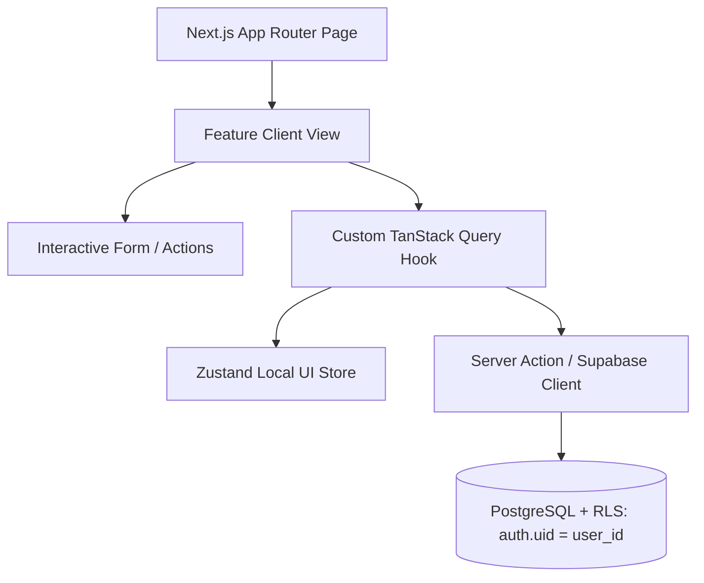

# Technical Design Document: [Feature Name]

> **Document Type**: **T**echnical **D**esign **D**ocument (TDD) / Architecture Document  
> **Purpose**: Bridges the PRD into an engineering plan, outlining component hierarchy, state boundaries (TanStack Query vs. Zustand), database wiring, and execution steps.

---

## 1. System Architecture & Data Flow



---

## 2. Component Hierarchy & File Mapping

```text
src/
├── app/
│   └── (dashboard)/
│       └── [feature-route]/
│           ├── page.tsx               # Server Component (Initial SSR Fetch/Prefetch)
│           ├── loading.tsx            # Skeleton loading state
│           └── error.tsx              # Error boundary
├── components/
│   └── features/
│       └── [feature-name]/
│           ├── [Feature]View.tsx      # Main orchestrator component
│           ├── [Feature]Card.tsx      # Individual list item card
│           ├── [Feature]Form.tsx      # React Hook Form + Zod validator
│           └── [Feature]Skeleton.tsx  # Matching skeleton loader
├── hooks/
│   └── use[Feature].ts                # TanStack query & mutation bindings
├── stores/
│   └── use[Feature]Store.ts           # Client UI state (filters, modal toggles)
└── lib/
    └── api/
        └── [feature-name].ts          # Data access layer & server actions
```

---

## 3. State Management Division
- **Server Cache / Remote State (TanStack Query v5)**:
  - Cache key: `['feature-name', userId, filters]`
  - Stale time: `1000 * 60 * 5` (5 minutes default)
  - Mutations handle cache invalidation (`queryClient.invalidateQueries({ queryKey: [...] })`) and optimistic rollbacks.
- **Client / Transient State (Zustand v5)**:
  - Active search term, open modal state, active tab, draft forms.

---

## 4. Implementation Checklist
- [ ] 1. Build UI pages & components with mock data (`src/components/features/...`).
- [ ] 2. Define SQL tables, RLS policies, and indexes in `supabase/schema/tables/`.
- [ ] 3. Run migration & generate TypeScript types (`src/types/supabase.ts`).
- [ ] 4. Create API functions / Server Actions in `src/lib/api/`.
- [ ] 5. Connect TanStack Query hooks & Zustand stores.
- [ ] 6. Replace mock data in UI components and test end-to-end.
