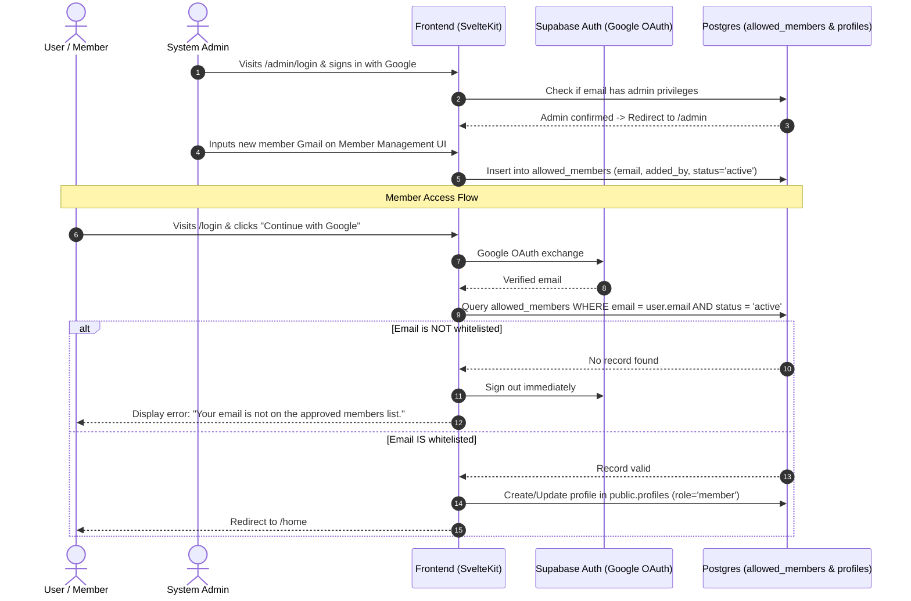

# PRD: Authentication, Member Whitelist & Admin Control

## 1. Executive Summary & Objective
- **Problem Statement**: Previously, any user signing in with a standard Google account could access the platform. Access must be restricted to explicitly authorized members managed by an administrator.
- **Proposed Solution**:
  1. **Admin Portal (`/admin/login` -> `/admin`)**: Dedicated administrative authentication flow and member management UI where admins can whitelist members by their Gmail address.
  2. **Whitelist-Enforced Member Access (`/login` -> `/home`)**: Standard Google OAuth sign-in verifies whether the user's Gmail is present in the approved member whitelist (`allowed_members`). If not whitelisted, sign-in is rejected and access is denied.
  3. **Role & Account Rules**:
     - An admin and a member can share the same email (e.g. an admin can also be a registered member with separate permissions/contexts).
     - Each regular member is uniquely identified by their email (1 regular member account per email).
- **Target Personas**:
  - **`guest`**: Public visitor browsing the landing page and docs.
  - **`member`**: Authenticated citizen whose Gmail exists on the approved whitelist; has isolated access to workspace (`/home`, diaries, passport).
  - **`admin`**: System administrator with access to `/admin` to whitelist/remove member Gmail accounts and manage platform settings.

## 2. Core Authentication & Access Control Flow

## 3. Key Requirements & Business Rules

### A. Admin Portal & Member Management (`/admin`)
1. **Admin Login (`/admin/login`)**:
   - Google OAuth sign-in specifically scoped for administrative access.
   - On success, verifies user email against designated admin records / `admin` role in `public.profiles`.
   - Successful admin login redirects to **`/admin`**.
2. **Member Whitelist Dashboard (`/admin`)**:
   - High-density list of whitelisted member emails (`List` component).
   - Inline Quick-Add form: Add a new member by Gmail address (with status: `active`).
   - Member removal / deactivation action: Revokes access for that Gmail.
   - Metadata tracking: `added_by`, `created_at`, `status`.

### B. Member Login & Whitelist Enforcement (`/login`)
1. **Member Sign In**:
   - Standard Google OAuth flow via `/login` directing to `/home`.
   - After OAuth exchange at `/auth/callback`, the backend/hook validates whether the user's email exists in `public.allowed_members` with `status = 'active'`.
   - **Unauthorized User Handling**: If email is not in `allowed_members`, the session is terminated (`signOut()`), and the user is redirected to `/login?error=unauthorized` with a clear explanation: *"This account has not been granted member access. Please contact an administrator."*

### C. Identity & Role Coexistence Rules
- **Shared Email Support**: An email can be registered as both an `admin` in `profiles` and as an approved `member` in `allowed_members`.
- **Unique Member Account**: Each approved member email has exactly one member profile (`UNIQUE(email)`).

---

## 4. Page Routes & Access Matrix

| Route / URL | Access Level | Description | Key Actions |
|---|---|---|---|
| `/` | Public (`guest` / `member`) | Landing Page | Explore platform, navigate to `/login` or `/home` |
| `/login` | Public / `guest` | Member Login Portal | Google OAuth for approved members, redirects to `/home` |
| `/admin/login` | Public / `guest` | Admin Login Portal | Google OAuth for system admins, redirects to `/admin` |
| `/admin` | `admin` only | Member Whitelist Management | View members, add member Gmail, revoke member access |
| `/auth/callback` | Transition | OAuth Code Exchange | Handles code exchange, whitelist verification & route redirection |
| `/home` | `member` / `admin` | Member Workspace | Access journals, tasks, passport |

---

## 5. Acceptance Criteria

- [ ] **AC-1 (Member Whitelist Check)**: Any non-whitelisted Google account attempting to sign in via `/login` is rejected and denied access.
- [ ] **AC-2 (Admin Portal UI)**: `/admin/login` and `/admin` routes exist with proper authorization guards.
- [ ] **AC-3 (Member Addition)**: Admin can enter a Gmail address in `/admin` to whitelist a new member.
- [ ] **AC-4 (Single Member Account)**: A member email cannot be duplicated in the active members registry.
- [ ] **AC-5 (Admin & Member Dual Role)**: An administrator using the same email as a member can operate administrative functions and access member features.

