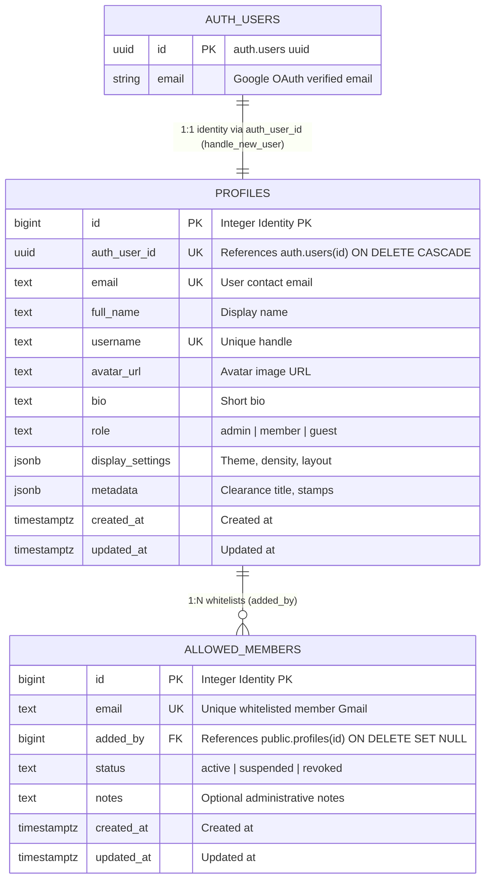

# Data Model: Authentication, Member Whitelist & Access Control

> [!NOTE]
> Database schema, entity relationships, whitelist table specifications, and security policies for Member Access & Admin Control.
> Uses integer identities for profiles and allowed members.

---

## 1. Entity Relationship Diagram (ERD)



---

## 2. Table Specifications

### Table: `public.allowed_members`
Whitelist registry of email addresses approved to log in as members.

| Column | Type | Nullable | Default / Constraints | Description |
| :--- | :--- | :--- | :--- | :--- |
| `id` | `bigint` | ❌ No | `GENERATED BY DEFAULT AS IDENTITY PK` | Unique integer whitelist record ID |
| `email` | `text` | ❌ No | Unique | Whitelisted Gmail address |
| `added_by` | `bigint` | ✅ Yes | `FK -> public.profiles(id) ON DELETE SET NULL` | Admin profile who approved member |
| `status` | `text` | ❌ No | `'active' CHECK (status IN ('active', 'suspended', 'revoked'))` | Membership approval status |
| `notes` | `text` | ✅ Yes | `NULL` | Administrative / team context |
| `created_at` | `timestamptz` | ❌ No | `now()` | Whitelist creation timestamp |
| `updated_at` | `timestamptz` | ❌ No | `now()` | Last modification timestamp |

---

### Table: `public.profiles`
Primary identity record extending Supabase `auth.users` via `auth_user_id`.

| Column | Type | Nullable | Default / Constraints | Description |
| :--- | :--- | :--- | :--- | :--- |
| `id` | `bigint` | ❌ No | `GENERATED BY DEFAULT AS IDENTITY PK` | Core integer user identity |
| `auth_user_id` | `uuid` | ✅ Yes | `Unique, FK -> auth.users(id) ON DELETE CASCADE` | Link to Supabase Auth UUID |
| `email` | `text` | ❌ No | Unique | Verified email |
| `full_name` | `text` | ✅ Yes | `NULL` | User display name |
| `username` | `text` | ✅ Yes | Unique | Handle for citations |
| `avatar_url` | `text` | ✅ Yes | `NULL` | Profile avatar URI |
| `bio` | `text` | ✅ Yes | `NULL` | Personal statement |
| `role` | `text` | ❌ No | `'member' CHECK (role IN ('admin', 'member', 'guest'))` | RBAC clearance level |
| `display_settings` | `jsonb` | ❌ No | `{'theme': 'system', 'density': 'comfortable'}` | UI preferences |
| `metadata` | `jsonb` | ❌ No | `{'clearance_title': 'Citizen Member'}` | Role metadata |
| `created_at` | `timestamptz` | ❌ No | `now()` | Registration timestamp |
| `updated_at` | `timestamptz` | ❌ No | `now()` | Last update timestamp |

---

## 3. Row-Level Security (RLS) & Triggers

### A. RLS Policies
- **`public.allowed_members`**:
  - `ALL`: Admins only (`profiles.role = 'admin'`).
  - `SELECT`: Authenticated users can check their own email (`email = auth.jwt()->>'email'`).
- **`public.profiles`**:
  - `SELECT`: Self only (`auth_user_id = auth.uid()`).
  - `UPDATE`: Self only (`auth_user_id = auth.uid()`).

### B. Trigger: `handle_new_user()`
```sql
create or replace function public.handle_new_user()
returns trigger
language plpgsql
security definer set search_path = public
as $$
declare
  is_admin boolean;
  is_whitelisted boolean;
begin
  select exists(select 1 from public.profiles where email = new.email and role = 'admin') into is_admin;
  select exists(select 1 from public.allowed_members where email = new.email and status = 'active') into is_whitelisted;

  insert into public.profiles (auth_user_id, email, full_name, avatar_url, role)
  values (
    new.id,
    new.email,
    coalesce(new.raw_user_meta_data->>'full_name', new.raw_user_meta_data->>'name', split_part(new.email, '@', 1)),
    coalesce(new.raw_user_meta_data->>'avatar_url', new.raw_user_meta_data->>'picture', ''),
    case when is_admin then 'admin' else 'member' end
  )
  on conflict (auth_user_id) do update set
    email = excluded.email,
    full_name = coalesce(excluded.full_name, profiles.full_name),
    avatar_url = coalesce(excluded.avatar_url, profiles.avatar_url),
    updated_at = now();

  return new;
end;
$$;
```

---

## 4. Zod Client & Server Validation Schemas

```typescript
import { z } from "zod";

export const userRoleSchema = z.enum(["admin", "member", "guest"]);
export type UserRole = z.infer<typeof userRoleSchema>;

export const addMemberSchema = z.object({
  email: z
    .string()
    .email("Please enter a valid email address")
    .transform((val) => val.trim().toLowerCase()),
  notes: z.string().max(250).optional(),
});
export type AddMemberInput = z.infer<typeof addMemberSchema>;

export const allowedMemberRowSchema = z.object({
  id: z.number().int().positive(),
  email: z.string().email(),
  added_by: z.number().int().positive().nullable(),
  status: z.enum(["active", "suspended", "revoked"]),
  notes: z.string().nullable(),
  created_at: z.string(),
  updated_at: z.string(),
});
export type AllowedMemberRow = z.infer<typeof allowedMemberRowSchema>;
```
