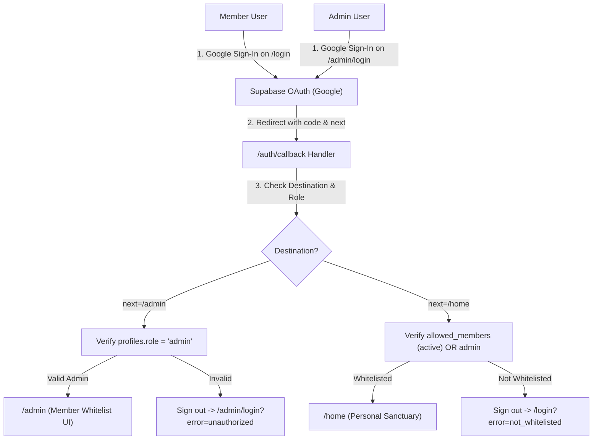

# Technical Design Document: Authentication, Member Whitelist & Admin Control

## 1. System Architecture & RBAC Flow



## 2. Component Hierarchy & File Mapping

```text
src/
├── routes/
│   ├── (auth)/
│   │   ├── login/
│   │   │   └── +page.svelte           # Member login portal
│   │   └── admin/
│   │       └── login/
│   │           └── +page.svelte       # Dedicated Admin login portal
│   ├── (app)/
│   │   ├── home/
│   │   │   └── +page.svelte           # Member workspace
│   │   └── admin/
│   │       └── +page.svelte           # Admin Member Management Panel
│   └── auth/
│       └── callback/
│           └── +server.ts             # OAuth exchange & whitelist verification handler
├── lib/
│   ├── components/
│   │   └── admin/
│   │       ├── member-list.svelte     # High density list of approved members
│   │       └── add-member-dialog.svelte # Quick-add Gmail dialog/inline form
│   └── services/
│       └── member-service.ts          # Admin Supabase client queries for allowed_members
```

## 3. Detailed Engineering Implementation

### A. Whitelist Enforcement Mechanism
1. Admin enters member Gmail address via the `/admin` panel.
2. Record is inserted into `public.allowed_members` with `status = 'active'`.
3. When any user signs in with Google on `/login`, the session exchange in `/auth/callback` verifies:
   ```sql
   SELECT 1 FROM public.allowed_members WHERE email = user_email AND status = 'active';
   ```
4. If not found and user is not an admin, `supabase.auth.signOut()` is executed immediately, preventing access and displaying a clear notice on `/login`.

### B. Shared Email Between Admin & Member
- Admins bypass member whitelist checks by virtue of having `role = 'admin'` in `public.profiles`.
- An email can be both in `allowed_members` and have an `admin` role in `profiles`.
- When an admin signs into `/admin/login`, they land on `/admin`. When signing in at `/login`, they land on `/home` as a member.

### C. Single Member Account Constraint
- `allowed_members.email` has a `UNIQUE` constraint in PostgreSQL.
- Member accounts in `public.profiles` maintain a `UNIQUE(email)` constraint.

