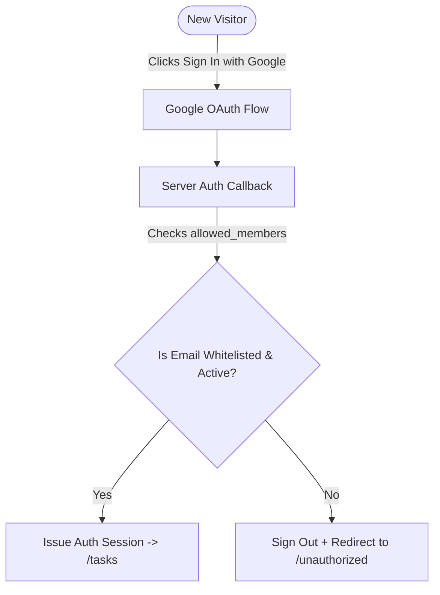
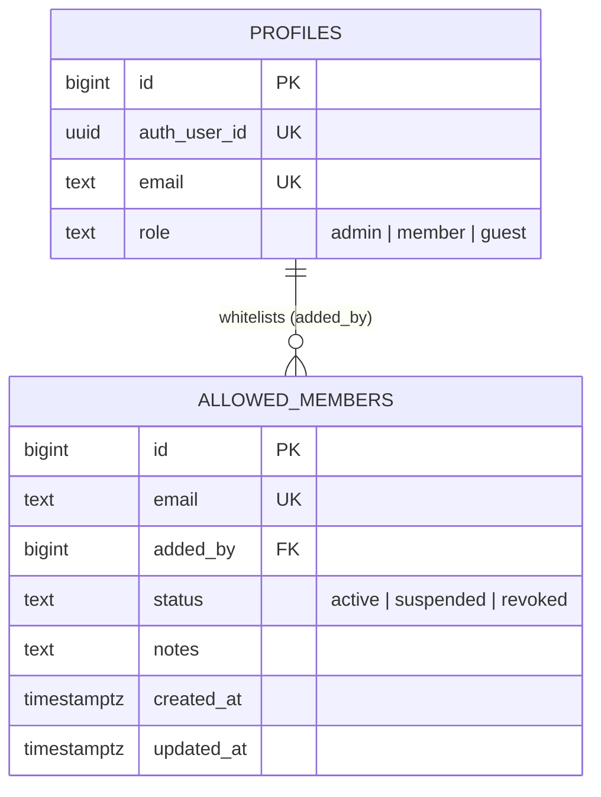

# Feature Spec: Authentication & Access Control

> [!NOTE]
> Living feature specification for Google OAuth, Whitelist Authorization, and RBAC in The Commons. Automatically rendered at `/dev/document`.

---

## 1. User Story & UX Flow

- **Problem Statement**: The application requires exclusive, closed-community access. Only whitelisted Google Gmail accounts can sign in. An administrative console is required to whitelist, suspend, or revoke members.
- **Target Persona**: All users (for OAuth login) and Administrators (for whitelist management).

### Primary Interaction Flows:
1. **Google OAuth Sign In**:
   - One-click Google sign-in via Supabase OAuth.
   - Redirects to `/auth/callback`.
2. **Whitelist Gatekeeper**:
   - Server checks `allowed_members` for the user's Gmail. If missing or suspended, the session is invalidated immediately.
3. **Admin Whitelist Console (`/admin`)**:
   - Admins can add new Gmail addresses, filter active/suspended members, add notes, or revoke access.

---

## 2. Database Schema & RLS Model

- **Primary Entities**: `public.allowed_members`, `public.profiles`.
- **Identity Key Standard**: `id bigint generated by default as identity primary key`.
- **Source of Truth**: Auto-generated in [`src/lib/types/database.types.ts`](file:///Users/daviditc/Documents/personal_projects/The-Commons/src/lib/types/database.types.ts) and visualizable via the `⚡ Live Schema` tab.

### Row Level Security (RLS) Rules:
- `allowed_members`: Readable by authenticated users to verify their own email; writable **only by users with `role = 'admin'`**.

---

## 3. Routes & Component Matrix

| Route / Component Path | Type | Responsibility |
| :--- | :--- | :--- |
| `src/routes/(auth)/login/+page.svelte` | Page View | Clean login screen with Google OAuth CTA |
| `src/routes/auth/callback/+server.ts` | Server Endpoint | Exchanges OAuth code and validates against `allowed_members` |
| `src/routes/(admin)/admin/+page.svelte` | Page View | Whitelist member manager (Add, Suspend, Revoke) |
| `src/routes/(admin)/admin/+page.server.ts` | Loader & Actions | Admin-only loader and member whitelist mutations |

---

## 4. Acceptance Criteria & Invariants

- [ ] **Hard Whitelist Barrier**: An unapproved Gmail account attempting login is rejected with an explanatory message.
- [ ] **Admin Role Guard**: Non-admin users navigating to `/admin` are immediately redirected.
- [ ] **Profile Sync Trigger**: Successful login guarantees a `public.profiles` row exists via Postgres triggers.
