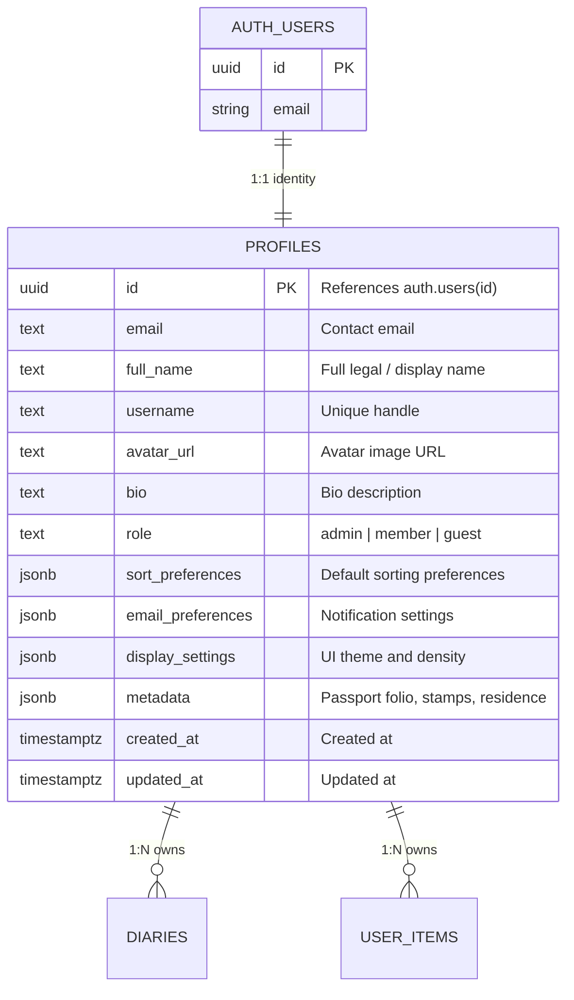

# Data Model: Citizen Passport & Member Profiles

> [!NOTE]
> Detailed schema, entity relationships, preferences JSON structure, and validation rules for Citizen Passports.

---

## 1. Entity Relationship Diagram



---

## 2. Table Specifications

### Table: `public.profiles`

| Column | Type | Nullable | Default / Constraints | Description |
| :--- | :--- | :--- | :--- | :--- |
| `id` | `uuid` | ❌ No | `PK -> auth.users(id) ON DELETE CASCADE` | Core user identifier matching auth |
| `email` | `text` | ❌ No | Unique | Verified email address |
| `full_name` | `text` | ✅ Yes | `NULL` | Citizen display name |
| `username` | `text` | ✅ Yes | Unique | Handle for citations |
| `avatar_url` | `text` | ✅ Yes | `NULL` | Avatar profile image |
| `bio` | `text` | ✅ Yes | `NULL` | Personal bio and statement |
| `role` | `text` | ❌ No | `'member' CHECK (role IN ('admin', 'member', 'guest'))` | RBAC role |
| `sort_preferences` | `jsonb` | ❌ No | `{'default_sort_by': 'created_at', ...}` | Sorting & pinning settings |
| `email_preferences`| `jsonb` | ❌ No | `{'transactional': true, ...}` | Email preferences |
| `display_settings` | `jsonb` | ❌ No | `{'theme': 'system', ...}` | UI appearance preferences |
| `metadata` | `jsonb` | ❌ No | `{'residence': '...', 'unlocked_stamps': [...]}` | Citizen stamps and credentials |
| `created_at` | `timestamptz` | ❌ No | `now()` | Registration timestamp |
| `updated_at` | `timestamptz` | ❌ No | `now()` | Last modification timestamp |

---

## 3. SQL Definitions

```sql
create table if not exists public.profiles (
  id uuid references auth.users(id) on delete cascade primary key,
  email text not null,
  full_name text,
  username text unique,
  avatar_url text,
  bio text,
  role text not null default 'member' check (role in ('admin', 'member', 'guest')),
  sort_preferences jsonb not null default jsonb_build_object(
    'default_sort_by', 'created_at',
    'default_sort_order', 'desc',
    'custom_order', '[]'::jsonb,
    'pinned_items', '[]'::jsonb,
    'filter_favorites_first', true
  ),
  email_preferences jsonb not null default jsonb_build_object(
    'marketing', false,
    'transactional', true,
    'newsletter', true,
    'product_updates', true,
    'digest_frequency', 'weekly'
  ),
  display_settings jsonb not null default jsonb_build_object(
    'theme', 'system',
    'density', 'comfortable',
    'view_mode', 'grid'
  ),
  metadata jsonb not null default jsonb_build_object(
    'residence', 'Archival Broadside',
    'clearance_title', 'Level II Scribe',
    'ritual_streak_days', 0,
    'unlocked_stamps', jsonb_build_array('founding_scribe')
  ),
  created_at timestamptz not null default now(),
  updated_at timestamptz not null default now()
);

create index idx_profiles_email on public.profiles(email);
create index idx_profiles_role on public.profiles(role);

alter table public.profiles enable row level security;
create policy "Authenticated users can view profiles" on public.profiles for select using (auth.role() = 'authenticated');
create policy "Users can update own profile" on public.profiles for update using (auth.uid() = id);
```

---

## 4. Zod Client & Server Validation

```typescript
import { z } from "zod";

export const updatePassportSchema = z.object({
  fullName: z.string().min(2, "Name must be at least 2 characters").max(60),
  bio: z.string().max(200, "Bio must be 200 characters or fewer").optional(),
  citizenTitle: z.string().max(50).optional(),
  avatarUrl: z.string().url("Must be a valid URL").or(z.literal("")).optional(),
});

export type UpdatePassportInput = z.infer<typeof updatePassportSchema>;
```
