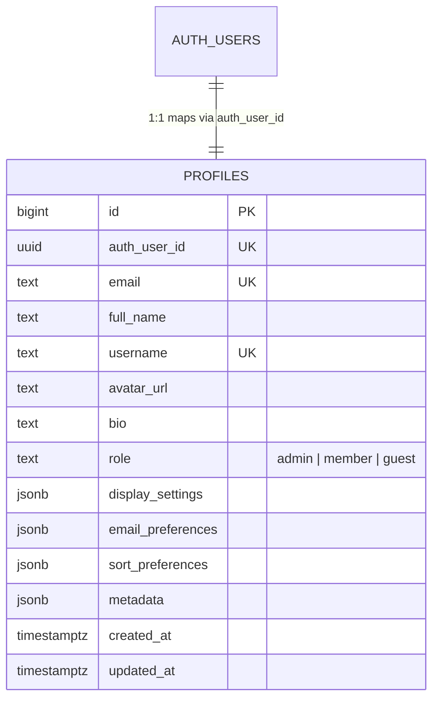

# Feature Spec: Citizen Profile & Preferences

> [!NOTE]
> Living feature specification for Member Profiles & Preferences in The Commons. Automatically rendered at `/dev/document`.

---

## 1. User Story & UX Flow

- **Problem Statement**: Members need a unified place to view their account standing, edit profile information (display name, avatar, bio), manage theme & display preferences, and configure notification settings.
- **Target Persona**: All authenticated members.

### Primary Interaction Flows:
1. **Profile Editing**:
   - User edits display name, handle/username, bio, and avatar URL.
2. **Display & Theme Preferences**:
   - User toggles density, theme mode, and default landing views (persisted in `profiles.display_settings`).
3. **Account Standing**:
   - Displays role (`admin`, `member`, `guest`) and registration date.

---

## 2. Database Schema & RLS Model

- **Primary Entities**: `public.profiles`.
- **Identity Key Standard**: `id bigint generated by default as identity primary key`.
- **Source of Truth**: Auto-generated in [`src/lib/types/database.types.ts`](file:///Users/daviditc/Documents/personal_projects/The-Commons/src/lib/types/database.types.ts) and visualizable via the `⚡ Live Schema` tab.

### Row Level Security (RLS) Rules:
- `SELECT`: Publicly viewable for basic fields, private for preferences.
- `UPDATE`: Enforces `using (auth_user_id = auth.uid())`.

---

## 3. Routes & Component Matrix

| Route / Component Path | Type | Responsibility |
| :--- | :--- | :--- |
| `src/routes/(app)/profile/+page.svelte` | Page View | Profile editor, avatar manager, preferences |
| `src/routes/(app)/profile/+page.server.ts` | Loader & Actions | Load profile details & execute profile updates |

---

## 4. Acceptance Criteria & Invariants

- [ ] **Handle Uniqueness**: Usernames must be unique across all profiles.
- [ ] **Auto-Provisioning**: Signing in with Google automatically creates a `public.profiles` row via the Postgres `handle_new_user` trigger.
- [ ] **Preferences Persistence**: Changes to `display_settings` persist instantly to the database.
