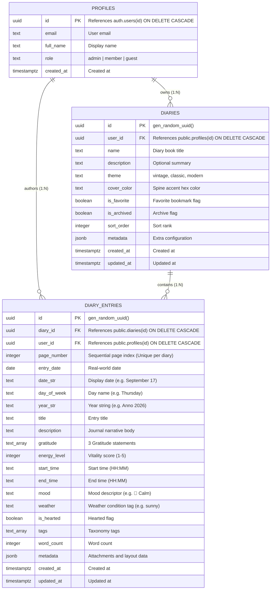

# Data Model: Daily Diary & Journal Entries

> [!NOTE]
> Database schema, entity relationships, constraints, and validation contracts for the Daily Diary & Journal feature in **The Commons**.

---

## 1. Entity Relationship Diagram



---

## 2. Table Specifications

### Table: `public.diaries`

| Column | Type | Nullable | Default / Constraints | Description |
| :--- | :--- | :--- | :--- | :--- |
| `id` | `uuid` | ❌ No | `gen_random_uuid() PK` | Unique diary book identifier |
| `user_id` | `uuid` | ❌ No | `FK -> public.profiles(id) ON DELETE CASCADE` | Owner user identifier |
| `name` | `text` | ❌ No | — | Book title |
| `description` | `text` | ✅ Yes | `NULL` | Optional summary description |
| `theme` | `text` | ❌ No | `'vintage' CHECK (theme IN ('vintage', 'classic', 'modern'))` | Visual skin and styling theme |
| `cover_color` | `text` | ✅ Yes | `'#8C3A27'` | Cover / spine hex color |
| `is_favorite` | `boolean` | ❌ No | `false` | Favorite status |
| `is_archived` | `boolean` | ❌ No | `false` | Soft archive flag |
| `sort_order` | `integer` | ❌ No | `0` | Reordering index |
| `metadata` | `jsonb` | ❌ No | `'{}'::jsonb` | Extended configuration |
| `created_at` | `timestamptz` | ❌ No | `now()` | Timestamp of creation |
| `updated_at` | `timestamptz` | ❌ No | `now()` | Timestamp of last modification |

---

### Table: `public.diary_entries`

| Column | Type | Nullable | Default / Constraints | Description |
| :--- | :--- | :--- | :--- | :--- |
| `id` | `uuid` | ❌ No | `gen_random_uuid() PK` | Entry primary identifier |
| `diary_id` | `uuid` | ❌ No | `FK -> public.diaries(id) ON DELETE CASCADE` | Parent diary container |
| `user_id` | `uuid` | ❌ No | `FK -> public.profiles(id) ON DELETE CASCADE` | Author user identifier |
| `page_number` | `integer` | ❌ No | `1 UNIQUE (diary_id, page_number)` | Sequential page index |
| `entry_date` | `date` | ❌ No | `current_date` | Date of entry |
| `date_str` | `text` | ❌ No | — | Formatted date string (e.g. "September 17") |
| `day_of_week`| `text` | ❌ No | — | Day name (e.g. "Thursday") |
| `year_str` | `text` | ❌ No | — | Year string (e.g. "Anno 2026") |
| `title` | `text` | ❌ No | `''` | Entry title headline |
| `description`| `text` | ❌ No | `''` | Main reflection narrative body |
| `gratitude` | `text[]` | ❌ No | `array['', '', '']::text[]` | 3 Daily gratitude lines |
| `energy_level`| `integer` | ❌ No | `3 CHECK (energy_level BETWEEN 1 AND 5)` | Vitality rating (1 to 5) |
| `start_time` | `text` | ✅ Yes | `'09:00'` | Start time (HH:MM) |
| `end_time` | `text` | ✅ Yes | `'17:00'` | End time (HH:MM) |
| `mood` | `text` | ❌ No | `'🌿 Calm'` | Mood string |
| `weather` | `text` | ❌ No | `'sunny'` | Weather identifier |
| `is_hearted` | `boolean` | ❌ No | `false` | Hearted memory bookmark |
| `tags` | `text[]` | ❌ No | `'{}'` | Categorization tags |
| `word_count` | `integer` | ❌ No | `0` | Calculated word count |
| `metadata` | `jsonb` | ❌ No | `'{}'::jsonb` | Media attachments and formatting |
| `created_at` | `timestamptz` | ❌ No | `now()` | Timestamp of creation |
| `updated_at` | `timestamptz` | ❌ No | `now()` | Timestamp of last modification |

---

## 3. SQL Table Definitions & Constraints

```sql
-- 1. Diaries Table
create table if not exists public.diaries (
  id uuid primary key default gen_random_uuid(),
  user_id uuid not null references public.profiles(id) on delete cascade,
  name text not null,
  description text,
  theme text not null default 'vintage' check (theme in ('vintage', 'classic', 'modern')),
  cover_color text default '#8C3A27',
  is_favorite boolean not null default false,
  is_archived boolean not null default false,
  sort_order integer not null default 0,
  metadata jsonb not null default '{}'::jsonb,
  created_at timestamptz not null default now(),
  updated_at timestamptz not null default now()
);

-- Indexes for Diaries
create index if not exists idx_diaries_user_sort on public.diaries (user_id, is_favorite desc, sort_order asc, created_at desc);
create index if not exists idx_diaries_user_archived on public.diaries (user_id, is_archived);

-- RLS for Diaries
alter table public.diaries enable row level security;
create policy "Users can view their own diaries" on public.diaries for select using (auth.uid() = user_id);
create policy "Users can insert their own diaries" on public.diaries for insert with check (auth.uid() = user_id);
create policy "Users can update their own diaries" on public.diaries for update using (auth.uid() = user_id) with check (auth.uid() = user_id);
create policy "Users can delete their own diaries" on public.diaries for delete using (auth.uid() = user_id);

-- 2. Diary Entries Table
create table if not exists public.diary_entries (
  id uuid primary key default gen_random_uuid(),
  diary_id uuid not null references public.diaries(id) on delete cascade,
  user_id uuid not null references public.profiles(id) on delete cascade,
  page_number integer not null default 1,
  entry_date date not null default current_date,
  date_str text not null,
  day_of_week text not null,
  year_str text not null,
  title text not null default '',
  description text not null default '',
  gratitude text[] not null default array['', '', '']::text[],
  energy_level integer not null default 3 check (energy_level between 1 and 5),
  start_time text default '09:00',
  end_time text default '17:00',
  mood text not null default '🌿 Calm',
  weather text not null default 'sunny',
  is_hearted boolean not null default false,
  tags text[] not null default '{}',
  word_count integer not null default 0,
  metadata jsonb not null default '{}'::jsonb,
  created_at timestamptz not null default now(),
  updated_at timestamptz not null default now(),

  constraint unique_diary_page_number unique (diary_id, page_number)
);

-- Indexes for Diary Entries
create index if not exists idx_diary_entries_diary_page on public.diary_entries (diary_id, page_number desc);
create index if not exists idx_diary_entries_user_date on public.diary_entries (user_id, entry_date desc);
create index if not exists idx_diary_entries_user_hearted on public.diary_entries (user_id, is_hearted) where is_hearted = true;
create index if not exists idx_diary_entries_tags on public.diary_entries using gin (tags);
create index if not exists idx_diary_entries_mood on public.diary_entries (user_id, mood);

-- RLS for Diary Entries
alter table public.diary_entries enable row level security;
create policy "Users can view their own diary entries" on public.diary_entries for select using (auth.uid() = user_id);
create policy "Users can insert their own diary entries" on public.diary_entries for insert with check (auth.uid() = user_id);
create policy "Users can update their own diary entries" on public.diary_entries for update using (auth.uid() = user_id) with check (auth.uid() = user_id);
create policy "Users can delete their own diary entries" on public.diary_entries for delete using (auth.uid() = user_id);
```

---

## 4. Zod Validation Schemas & TypeScript Contracts

```typescript
import { z } from "zod";

export const diaryPaginationQuerySchema = z.object({
  limit: z.number().int().min(1).max(100).default(24),
  offset: z.number().int().min(0).default(0),
  includeSummary: z.boolean().default(true),
  isArchived: z.boolean().default(false),
});

export const diarySchema = z.object({
  name: z.string().min(1, "Name is required").max(80),
  description: z.string().max(280).optional(),
  theme: z.enum(["vintage", "classic", "modern"]).default("vintage"),
  coverColor: z.string().default("#8C3A27"),
});

export const updateDiarySchema = z.object({
  id: z.string().uuid(),
  name: z.string().min(1).max(80).optional(),
  description: z.string().max(280).optional().nullable(),
  theme: z.enum(["vintage", "classic", "modern"]).optional(),
  coverColor: z.string().optional(),
  isFavorite: z.boolean().optional(),
  isArchived: z.boolean().optional(),
  sortOrder: z.number().int().optional(),
});

export const deleteDiarySchema = z.object({
  id: z.string().uuid(),
});

export const diaryEntrySchema = z.object({
  id: z.string().optional(),
  diaryId: z.string().uuid(),
  pageNumber: z.number().int().positive().optional(),
  entryDate: z.string().optional(),
  dateStr: z.string().optional(),
  dayOfWeek: z.string().optional(),
  yearStr: z.string().optional(),
  title: z.string().max(140).default(""),
  description: z.string().default(""),
  gratitude: z.tuple([z.string(), z.string(), z.string()]).default(["", "", ""]),
  energyLevel: z.number().int().min(1).max(5).default(3),
  startTime: z.string().default("09:00"),
  endTime: z.string().default("17:00"),
  mood: z.string().default("🌿 Calm"),
  weather: z.string().default("sunny"),
  isHearted: z.boolean().default(false),
  tags: z.array(z.string()).default([]),
  wordCount: z.number().int().default(0),
});

export const diarySummarySchema = z.object({
  totalDiaries: z.number().int(),
  activeDiaries: z.number().int(),
  archivedDiaries: z.number().int(),
  totalEntries: z.number().int(),
  totalWords: z.number().int(),
  averageEnergy: z.number(),
  currentStreak: z.number().int(),
  longestStreak: z.number().int(),
  latestEntryDate: z.string().nullable(),
  moodBreakdown: z.record(z.string(), z.number()),
});

export const paginationMetaSchema = z.object({
  totalCount: z.number().int(),
  limit: z.number().int(),
  offset: z.number().int(),
  hasMore: z.boolean(),
  nextOffset: z.number().int().nullable(),
});

export const diaryIndexEntrySchema = z.object({
  id: z.string(),
  pageNumber: z.number().int(),
  dateStr: z.string(),
  dayOfWeek: z.string().optional(),
  yearStr: z.string().optional(),
  title: z.string(),
  snippet: z.string(),
  mood: z.string(),
  isHearted: z.boolean(),
  wordCount: z.number().int(),
});

export const diaryStatsSchema = z.object({
  diaryId: z.string().uuid().nullable().optional(),
  totalEntries: z.number().int(),
  totalWords: z.number().int(),
  averageEnergy: z.number(),
  heartedEntries: z.number().int(),
  currentStreak: z.number().int(),
  longestStreak: z.number().int(),
  moodBreakdown: z.record(z.string(), z.number()),
  tags: z.array(z.string()),
  topWritingHours: z.array(z.string()).optional(),
});

export type DiaryPaginationQuery = z.infer<typeof diaryPaginationQuerySchema>;
export type CreateDiaryInput = z.infer<typeof diarySchema>;
export type UpdateDiaryInput = z.infer<typeof updateDiarySchema>;
export type DeleteDiaryInput = z.infer<typeof deleteDiarySchema>;
export type CreateEntryInput = z.infer<typeof diaryEntrySchema>;
export type DiarySummary = z.infer<typeof diarySummarySchema>;
export type PaginationMeta = z.infer<typeof paginationMetaSchema>;
export type DiaryIndexEntry = z.infer<typeof diaryIndexEntrySchema>;
export type DiaryStats = z.infer<typeof diaryStatsSchema>;
```
