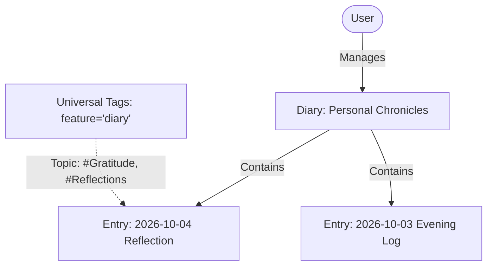
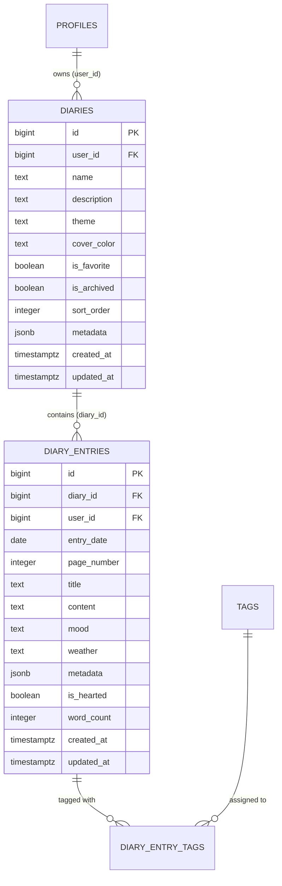

# Feature Spec: Daily Diary & Journal Archive

> [!NOTE]
> Living feature specification for the Daily Diary & Journal Archive in The Commons. Automatically rendered at `/dev/document`.

---

## 1. User Story & UX Flow

- **Problem Statement**: Users need an archival-grade, distraction-free digital journal to capture daily reflections, logs, gratitude entries, mood/weather metrics, and long-form writing with instant autosave and leaf navigation.
- **Target Persona**: Writers, researchers, and daily journaling members.

### Primary Interaction Flows:
1. **Diary Creation & Theming**:
   - User creates multiple named diaries with custom themes (e.g. `classic`, `modern`, `minimal`) and cover colors.
2. **Daily Entry Writing & Autosave**:
   - User writes rich text or markdown with live word-count and character tally.
   - Autosaves drafts in the background without UI interruption.
3. **Structured Metrics**:
   - Logs daily mood, weather, gratitude items, and start/finish timestamps.
4. **Archival Reading Mode**:
   - Toggle between edit mode and a clean book-like reading layout with leaf navigation (`page_number`).

---

## 2. Database Schema & RLS Model

- **Primary Entities**: `public.diaries`, `public.diary_entries`, `public.diary_entry_tags`.
- **Identity Key Standard**: `id bigint generated by default as identity primary key`.
- **Source of Truth**: Auto-generated in [`src/lib/types/database.types.ts`](file:///Users/daviditc/Documents/personal_projects/The-Commons/src/lib/types/database.types.ts) and visualizable via the `⚡ Live Schema` tab.

### Row Level Security (RLS) Rules:
- Enforces strict user isolation: `using (user_id = (select id from public.profiles where auth_user_id = auth.uid()))`.

---

## 3. Routes & Component Matrix

| Route / Component Path | Type | Responsibility |
| :--- | :--- | :--- |
| `src/routes/(app)/diary/+page.svelte` | Page View | Diary index, book selection, recent entries digest |
| `src/routes/(app)/diary/[id]/+page.svelte` | Page View | Active diary editor & leaf reading view |
| `src/routes/(app)/diary/[id]/+page.server.ts` | Loader & Actions | Loads diary metadata and entry list |
| `src/lib/components/TagManagementSidePanel.svelte` | Side Panel | Tag assignment scoped to `diary` |

---

## 4. Acceptance Criteria & Invariants

- [ ] **UUID-Free IDs**: All diaries and entries use `bigint` identity keys.
- [ ] **Leaf Sequence**: `page_number` is computed sequentially per diary book for archival display.
- [ ] **Reliable Autosave**: Edits are persisted transparently without losing cursor state.
- [ ] **Strict Isolation**: RLS ensures users can only read or modify their own journal entries.
