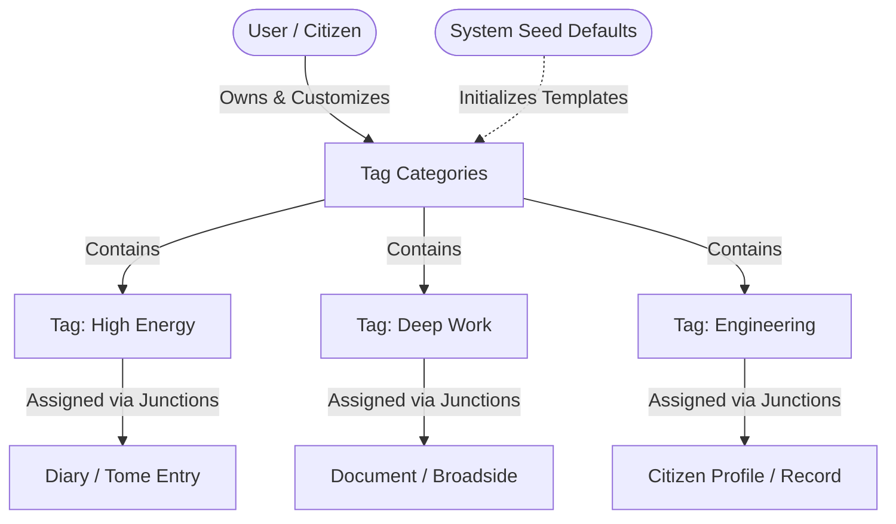

# PRD: Universal Document & Entity Tagging System

## 1. Executive Summary & Objective
- **Problem Statement**: As users create content across different features in The Commons (e.g., Daily Diaries, Documents, Citizen Records, Notes), organizing and filtering content becomes difficult without a structured, multi-dimensional taxonomy. Users need a way to group entities by custom contextual dimensions (e.g., "Context", "Energy Level", "Department", "Mood", "Priority").
- **Proposed Solution**: A universal, categorized tagging architecture composed of **Tag Categories** (e.g., Context, Energy Level, Department) and **Tags** (e.g., Deep Work, High Energy, Engineering, Finance). Each feature can leverage dedicated or shared categories, with the system supplying pre-populated default tag templates while allowing users to create, color-code, and manage their own custom tags. These tags power universal cross-feature filtering, search indexing, and visual badge classification.
- **Target Persona**: Writers, knowledge workers, researchers, and administrators requiring fast retrieval, multi-attribute filtering, and structured classification across all application modules.

---

## 2. Core Concepts & Taxonomy

1. **Tag Categories**: Top-level semantic dimensions (e.g., `Context`, `Energy Level`, `Department`, `Project`, `Lifecycle`). Categories enforce organization, UI grouping, and distinct color palettes.
2. **Tags**: Individual metadata labels belonging to a specific category. Tags inherit category styling unless explicitly overridden with a custom accent color.
3. **Feature Scoping & On-Demand Provisioning**: When a user opens or requires tags for a specific feature (e.g. Daily Diary, Document Reader), an on-demand RPC (`provision_feature_tag_categories`) is invoked to ensure the feature's tag categories exist before loading tags. Users retain full autonomy to add, edit, reorder, or customize tags under their categories.
4. **Universal Filter Facets**: Multi-select filter bars throughout the app consume categorized tags to provide faceted search (e.g., filter entries where `Context = Deep Work` AND `Energy Level = High Energy`).

---

## 3. User Stories & Acceptance Criteria

### User Story 1 (Category & Tag Management)
> *As a user, I want to create, customize, and color-code tag categories and individual tags so that I can organize my data according to my personal workflow.*

- [ ] **Create Category**: User can create a new category with a custom name, color hex code, feature scope, and display order.
- [ ] **Create Tag**: User can create tags under any existing category with unique names per category.
- [ ] **On-Demand Feature Tag Provisioning**: When a feature requests tags, an RPC seamlessly ensures the feature's initial category structure exists if not already present.
- [ ] **Color Overrides**: Individual tags can inherit their category's color or specify a custom color badge.
- [ ] **Inline Tag Creation**: Users typing in a tag selector combobox can press `Enter` or click "Create new tag" to create a tag in-place without navigating away.

### User Story 2 (Document & Entity Assignment)
> *As a user editing a document or diary entry, I want to assign and remove tags quickly with keyboard-friendly comboboxes.*

- [ ] **Multi-Select Combobox**: Searchable dropdown grouping available tags under their respective category headers.
- [ ] **Visual Pills**: Selected tags render as tactile badges/pills with category badges, color dots, and single-click remove buttons (`×`).
- [ ] **Keyboard Navigation**: Arrow keys navigate tag suggestions; `Enter` selects; `Backspace` on an empty input removes the previous tag.
- [ ] **Optimistic Updates**: Tag assignments and removals update immediately in the UI before network confirmation.

### User Story 3 (Faceted Filtering & Search Across Features)
> *As a user browsing my documents or diary pages, I want to filter items by one or more tag categories so that I can pinpoint relevant content.*

- [ ] **Category Filter Bar**: Horizontal facet bar with dropdown multi-select filters for each category.
- [ ] **Active Filter Chips**: Selected tag filters appear as active chips with quick "Clear All" or individual removal.
- [ ] **AND/OR Filter Logic**: Filtering within the same category uses `OR` logic (e.g. `Energy = High OR Medium`), while filtering across categories uses `AND` logic (e.g. `Context = Deep Work AND Energy = High`).
- [ ] **URL Query Sync**: Active tag filters synchronize with URL search parameters (e.g., `?tags=101,201`) for bookmarkable and shareable filter views.

---

## 4. UI Components & Visual States

| Component | Purpose & Placement | Interactions |
|---|---|---|
| `<TagBadge />` | Renders a color-coded tag pill with optional category label and remove button. | Hover highlight, click to filter, `×` click to unassign. |
| `<TagPicker />` | Grouped combobox popover for searching and multi-selecting tags on an entity. | Typeahead search, grouped category headers, "Create tag" action. |
| `<TagFilterBar />` | Top toolbar in document/diary index views displaying category facet buttons. | Opens category dropdown, counts active filters, triggers query re-fetch. |
| **`/tag-management` Page** | Dedicated page listing all tag categories with feature badges and tag count. | Add category, edit category, delete category, click category to open side dialog. |
| `<TagSideDialog />` | Side drawer / dialog displaying child tags for a selected category. | Add, edit, delete tags under category. System tags render in readonly mode (`🔒`). |

### Visual & Interactive States
- **Normal State**: Clean solid alpha pill with contrasting text and accent indicator dot.
- **Active / Filtered State**: Inverted solid accent fill with crisp border indicator.
- **Loading Skeleton**: Shimmering pill placeholders matching tag pill dimensions.
- **Empty State**: "No tags yet. Type to create one..." placeholder inside comboboxes.
- **Validation Error State**: Red highlight on duplicate tag names within the same category.
