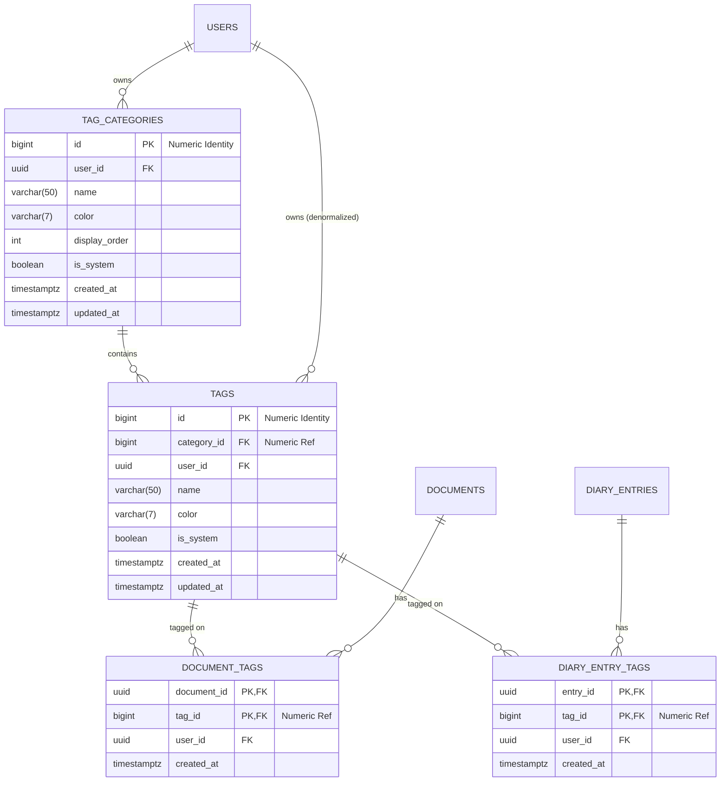

# Data Model: Tag Categories & Universal Tagging System

## 1. Entity Relationship Diagram (ERD)



---

## 2. PostgreSQL DDL Schema

```sql
-- ==============================================================================
-- 1. TAG CATEGORIES TABLE (Numeric ID)
-- ==============================================================================
CREATE TABLE IF NOT EXISTS public.tag_categories (
    id BIGINT GENERATED BY DEFAULT AS IDENTITY PRIMARY KEY,
    user_id UUID NOT NULL REFERENCES public.profiles(id) ON DELETE CASCADE,
    feature TEXT NOT NULL DEFAULT 'general',
    name VARCHAR(50) NOT NULL,
    color VARCHAR(7) NOT NULL DEFAULT '#6B7280',
    display_order INT NOT NULL DEFAULT 0,
    is_system BOOLEAN NOT NULL DEFAULT false,
    created_at TIMESTAMPTZ NOT NULL DEFAULT NOW(),
    updated_at TIMESTAMPTZ NOT NULL DEFAULT NOW(),

    -- Ensure a user cannot create duplicate category names within the same feature
    CONSTRAINT uq_user_feature_category_name UNIQUE (user_id, feature, name)
);

-- ==============================================================================
-- 2. TAGS TABLE (Numeric ID)
-- ==============================================================================
CREATE TABLE IF NOT EXISTS public.tags (
    id BIGINT GENERATED BY DEFAULT AS IDENTITY PRIMARY KEY,
    category_id BIGINT NOT NULL REFERENCES public.tag_categories(id) ON DELETE CASCADE,
    user_id UUID NOT NULL REFERENCES public.profiles(id) ON DELETE CASCADE,
    name VARCHAR(50) NOT NULL,
    color VARCHAR(7) DEFAULT NULL, -- NULL means inherit category color
    is_system BOOLEAN NOT NULL DEFAULT false,
    created_at TIMESTAMPTZ NOT NULL DEFAULT NOW(),
    updated_at TIMESTAMPTZ NOT NULL DEFAULT NOW(),

    -- Ensure tag names are unique within a specific category for a given user
    CONSTRAINT uq_user_tag_in_category UNIQUE (category_id, name)
);

-- ==============================================================================
-- 3. JUNCTION TABLE: DOCUMENT TAGS
-- ==============================================================================
CREATE TABLE IF NOT EXISTS public.document_tags (
    document_id UUID NOT NULL,
    tag_id BIGINT NOT NULL REFERENCES public.tags(id) ON DELETE CASCADE,
    user_id UUID NOT NULL REFERENCES public.profiles(id) ON DELETE CASCADE,
    created_at TIMESTAMPTZ NOT NULL DEFAULT NOW(),

    PRIMARY KEY (document_id, tag_id)
);

-- ==============================================================================
-- 4. JUNCTION TABLE: DIARY ENTRY TAGS
-- ==============================================================================
CREATE TABLE IF NOT EXISTS public.diary_entry_tags (
    entry_id UUID NOT NULL REFERENCES public.diary_entries(id) ON DELETE CASCADE,
    tag_id BIGINT NOT NULL REFERENCES public.tags(id) ON DELETE CASCADE,
    user_id UUID NOT NULL REFERENCES public.profiles(id) ON DELETE CASCADE,
    created_at TIMESTAMPTZ NOT NULL DEFAULT NOW(),

    PRIMARY KEY (entry_id, tag_id)
);
```

---

## 3. Performance Indexes

```sql
-- Index on tag_categories for fast user lookup and display ordering
CREATE INDEX IF NOT EXISTS idx_tag_categories_user_order 
    ON public.tag_categories(user_id, display_order ASC, name ASC);

-- Index on tags for category and user filtering
CREATE INDEX IF NOT EXISTS idx_tags_category_id 
    ON public.tags(category_id);

CREATE INDEX IF NOT EXISTS idx_tags_user_id 
    ON public.tags(user_id, name ASC);

-- Indexes on junction tables for bi-directional lookups
CREATE INDEX IF NOT EXISTS idx_document_tags_tag_id 
    ON public.document_tags(tag_id, user_id);

CREATE INDEX IF NOT EXISTS idx_diary_entry_tags_tag_id 
    ON public.diary_entry_tags(tag_id, user_id);
```

---

## 4. Row Level Security (RLS) Policies

```sql
-- Enable RLS on all tables
ALTER TABLE public.tag_categories ENABLE ROW LEVEL SECURITY;
ALTER TABLE public.tags ENABLE ROW LEVEL SECURITY;
ALTER TABLE public.document_tags ENABLE ROW LEVEL SECURITY;
ALTER TABLE public.diary_entry_tags ENABLE ROW LEVEL SECURITY;

-- Tag Categories Policies
CREATE POLICY "Users can view own tag categories"
    ON public.tag_categories FOR SELECT
    USING (auth.uid() = user_id);

CREATE POLICY "Users can insert own tag categories"
    ON public.tag_categories FOR INSERT
    WITH CHECK (auth.uid() = user_id);

CREATE POLICY "Users can update own tag categories"
    ON public.tag_categories FOR UPDATE
    USING (auth.uid() = user_id)
    WITH CHECK (auth.uid() = user_id);

CREATE POLICY "Users can delete own tag categories"
    ON public.tag_categories FOR DELETE
    USING (auth.uid() = user_id);

-- Tags Policies (System tags cannot be updated or deleted by users)
CREATE POLICY "Users can view own tags"
    ON public.tags FOR SELECT
    USING (auth.uid() = user_id);

CREATE POLICY "Users can insert own tags"
    ON public.tags FOR INSERT
    WITH CHECK (auth.uid() = user_id);

CREATE POLICY "Users can update own tags"
    ON public.tags FOR UPDATE
    USING (auth.uid() = user_id AND is_system = false)
    WITH CHECK (auth.uid() = user_id AND is_system = false);

CREATE POLICY "Users can delete own tags"
    ON public.tags FOR DELETE
    USING (auth.uid() = user_id AND is_system = false);

-- Document Tags Junction Policies
CREATE POLICY "Users can view own document tags"
    ON public.document_tags FOR SELECT
    USING (auth.uid() = user_id);

CREATE POLICY "Users can manage own document tags"
    ON public.document_tags FOR ALL
    USING (auth.uid() = user_id)
    WITH CHECK (auth.uid() = user_id);

-- Diary Entry Tags Junction Policies
CREATE POLICY "Users can view own diary entry tags"
    ON public.diary_entry_tags FOR SELECT
    USING (auth.uid() = user_id);

CREATE POLICY "Users can manage own diary entry tags"
    ON public.diary_entry_tags FOR ALL
    USING (auth.uid() = user_id)
    WITH CHECK (auth.uid() = user_id);
```

---

## 5. Zod Validation Schemas (Client & Server)

```typescript
import { z } from "zod";

// Hex Color validation regex (#RGB or #RRGGBB)
export const hexColorSchema = z
  .string()
  .regex(/^#([0-9A-F]{3}){1,2}$/i, "Must be a valid hex color code (e.g. #6B7280)");

// Tag Category Schemas
export const createTagCategorySchema = z.object({
  feature: z.string().trim().min(1).default("general"),
  name: z.string().trim().min(1, "Name is required").max(50, "Maximum 50 characters"),
  color: hexColorSchema.default("#6B7280"),
  display_order: z.number().int().nonnegative().default(0),
});

export const updateTagCategorySchema = createTagCategorySchema.partial();

// Tag Schemas (Numeric Category ID)
export const createTagSchema = z.object({
  category_id: z.number().int().positive("Invalid numeric category ID"),
  name: z.string().trim().min(1, "Tag name is required").max(50, "Maximum 50 characters"),
  color: hexColorSchema.nullable().optional(),
});

export const updateTagSchema = z.object({
  name: z.string().trim().min(1).max(50).optional(),
  color: hexColorSchema.nullable().optional(),
  category_id: z.number().int().positive().optional(),
});

// Entity Assignment Schema (Numeric Tag IDs)
export const syncEntityTagsSchema = z.object({
  entity_id: z.string().uuid("Invalid entity UUID"),
  entity_type: z.enum(["document", "diary_entry"]),
  tag_ids: z.array(z.number().int().positive("Invalid numeric tag ID")),
});
```

---

## 6. On-Demand Feature Tag Provisioning RPC

```sql
CREATE OR REPLACE FUNCTION public.provision_feature_tag_categories(p_feature TEXT)
RETURNS JSONB
LANGUAGE plpgsql
SECURITY DEFINER
SET search_path = public
AS $$
DECLARE
    v_user_id UUID := auth.uid();
    v_cat_id BIGINT;
    v_count INT;
BEGIN
    IF v_user_id IS NULL THEN
        RAISE EXCEPTION 'Not authenticated';
    END IF;

    -- Check if user already has categories for this feature
    SELECT COUNT(*) INTO v_count
    FROM public.tag_categories
    WHERE user_id = v_user_id AND feature = p_feature;

    IF v_count = 0 THEN
        IF p_feature = 'diary' THEN
            -- Context category
            INSERT INTO public.tag_categories (user_id, feature, name, color, display_order, is_system)
            VALUES (v_user_id, 'diary', 'Context', '#3B82F6', 1, true)
            ON CONFLICT (user_id, feature, name) DO NOTHING
            RETURNING id INTO v_cat_id;
            
            IF v_cat_id IS NOT NULL THEN
                INSERT INTO public.tags (category_id, user_id, name, is_system)
                VALUES 
                    (v_cat_id, v_user_id, 'Deep Work', true),
                    (v_cat_id, v_user_id, 'Reflections', true),
                    (v_cat_id, v_user_id, 'Planning', true)
                ON CONFLICT (category_id, name) DO NOTHING;
            END IF;

            -- Energy Level category
            INSERT INTO public.tag_categories (user_id, feature, name, color, display_order, is_system)
            VALUES (v_user_id, 'diary', 'Energy Level', '#10B981', 2, true)
            ON CONFLICT (user_id, feature, name) DO NOTHING
            RETURNING id INTO v_cat_id;

            IF v_cat_id IS NOT NULL THEN
                INSERT INTO public.tags (category_id, user_id, name, is_system)
                VALUES 
                    (v_cat_id, v_user_id, 'High Vitality', true),
                    (v_cat_id, v_user_id, 'Medium Vitality', true),
                    (v_cat_id, v_user_id, 'Rest & Recovery', true)
                ON CONFLICT (category_id, name) DO NOTHING;
            END IF;

        ELSIF p_feature = 'document' THEN
            -- Department category
            INSERT INTO public.tag_categories (user_id, feature, name, color, display_order, is_system)
            VALUES (v_user_id, 'document', 'Department', '#8B5CF6', 1, true)
            ON CONFLICT (user_id, feature, name) DO NOTHING
            RETURNING id INTO v_cat_id;

            IF v_cat_id IS NOT NULL THEN
                INSERT INTO public.tags (category_id, user_id, name, is_system)
                VALUES 
                    (v_cat_id, v_user_id, 'Engineering', true),
                    (v_cat_id, v_user_id, 'Research', true),
                    (v_cat_id, v_user_id, 'Governance', true)
                ON CONFLICT (category_id, name) DO NOTHING;
            END IF;

            -- Document Type category
            INSERT INTO public.tag_categories (user_id, feature, name, color, display_order, is_system)
            VALUES (v_user_id, 'document', 'Document Type', '#F59E0B', 2, true)
            ON CONFLICT (user_id, feature, name) DO NOTHING
            RETURNING id INTO v_cat_id;

            IF v_cat_id IS NOT NULL THEN
                INSERT INTO public.tags (category_id, user_id, name, is_system)
                VALUES 
                    (v_cat_id, v_user_id, 'Report', true),
                    (v_cat_id, v_user_id, 'Charter', true),
                    (v_cat_id, v_user_id, 'Dispatch', true)
                ON CONFLICT (category_id, name) DO NOTHING;
            END IF;
        ELSE
            -- Default custom category for other features
            INSERT INTO public.tag_categories (user_id, feature, name, color, display_order, is_system)
            VALUES (v_user_id, p_feature, 'General', '#6B7280', 1, false)
            ON CONFLICT (user_id, feature, name) DO NOTHING;
        END IF;
    END IF;

    RETURN jsonb_build_object(
        'success', true,
        'feature', p_feature,
        'provisioned', (v_count = 0)
    );
END;
$$;
```
