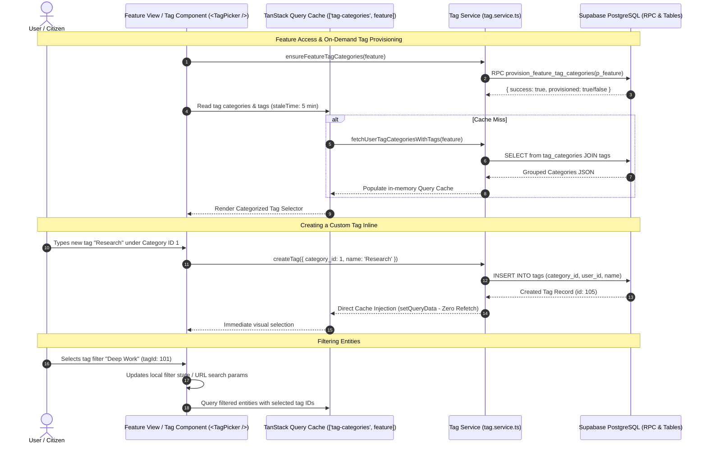

# Technical Design Document (TDD): Universal Tagging Architecture

## 1. System Architecture & Data Flow



---

## 2. Component Hierarchy & File Sitemap

```
src/
├── app/
│   └── (dashboard)/
│       ├── tag-management/
│       │   └── page.tsx                          # Dedicated tag categories & management page
│       ├── my-diaries/
│       │   └── components/
│       │       └── diary-tag-filter-bar.tsx      # Diary-specific tag facet toolbar
│       └── documents/
│           └── components/
│               └── document-tag-filter-bar.tsx   # Document-specific tag facet toolbar
├── components/
│   └── tags/
│       ├── tag-badge.tsx                         # Reusable colored tag pill / badge (< 150 lines)
│       ├── tag-picker.tsx                        # Popover combobox with category grouping (< 280 lines)
│       ├── tag-filter-bar.tsx                    # Multi-select category facet bar (< 250 lines)
│       ├── tag-side-dialog.tsx                   # Side drawer / dialog for category tags CRUD & readonly system tags (< 280 lines)
│       ├── tag-category-form-modal.tsx           # Modal for creating/editing categories (< 200 lines)
│       └── tag-icons.tsx                         # Lightweight SVG icons for tags & categories (< 120 lines)
├── hooks/
│   └── queries/
│       └── use-tag-queries.ts                    # TanStack Query v5 hooks (useTagCategoriesQuery, useEntityTagsQuery, etc.)
├── services/
│   └── tag.service.ts                            # Direct Supabase database client functions
└── types/
    └── tags.ts                                   # Shared TypeScript types & interfaces
```

---

## 3. State Management: TanStack Query v5 Exclusively

### 3.1 Server State & Cache Architecture
- **No Zustand Store**: All server caching, entity association, and tag mutations are handled exclusively through TanStack Query v5.
- **Cache Keys**:
  - `tagKeys.categories(feature)`: `['tag-categories', feature || 'all']`
  - `tagKeys.entityTags(entityType, entityId)`: `['entity-tags', entityType, entityId]`
- **Cache Synchronization Strategy**:
  - Direct cache updates via `queryClient.setQueryData` on tag creation, update, and deletion.
  - **Zero redundant refetches**: When creating a tag or category, inject the new record into the existing category array without invalidating and re-querying the whole collection over the network.

---

## 4. UI/UX & Rendering Performance Guidelines
- **No Blur Effects**: In accordance with project performance guidelines, do not use `backdrop-blur-*` or CSS `backdrop-filter: blur()`. Use solid alpha backgrounds (e.g. `bg-background/95`) and crisp border styling.
- **Contrast Ratios**: Tag colors automatically compute high-contrast foreground text (light or dark) depending on the hex luminance value.
- **Modular Component Threshold**: Every tag component remains strictly under 300 lines of code.

---

## 5. Sequential Implementation Checklist

1. [ ] **Database Migration**: Run the migration containing `tag_categories` (numeric `id`), `tags` (numeric `id`), `document_tags`, `diary_entry_tags`, indexes, triggers, and RLS policies.
2. [ ] **TypeScript Types & Services**: Implement `src/types/tags.ts`, update `src/types/database.ts`, and implement `src/services/tag.service.ts`.
3. [ ] **TanStack Query Hooks**: Implement `src/hooks/queries/use-tag-queries.ts` with optimistic cache updates and zero redundant refetches.
4. [ ] **UI Components**: Build `<TagBadge />`, `<TagPicker />`, `<TagFilterBar />`, and `<TagCategoryManagerModal />`.
5. [ ] **Feature Integration**: Integrate `<TagPicker />` into the Daily Diary entry editor and Document editor.
6. [ ] **Verification**: Run `pnpm tsc --noEmit` and verify zero-refetch cache performance.
