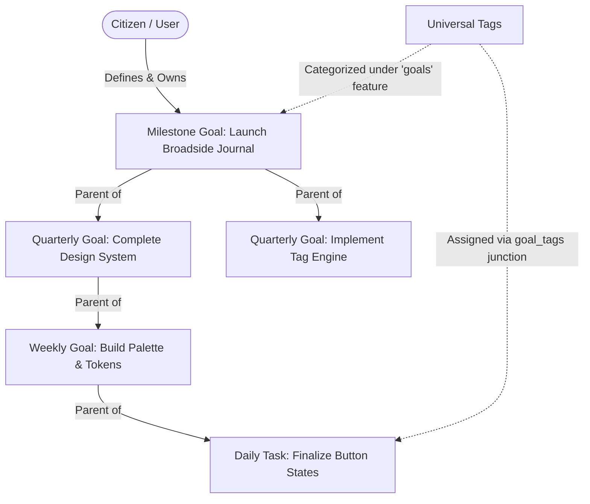

# PRD: Goals & Objectives Ledger

## 1. Executive Summary & Objective
- **Problem Statement**: Citizens and knowledge workers using *The Commons* need a structured, hierarchical mechanism to set, decompose, track, and accomplish initiatives ranging from long-term milestones to daily operational tasks. Without a unified ledger connecting high-level ambition to daily execution, accountability and visibility degrade.
- **Proposed Solution**: The **Goals & Objectives Ledger** is an archival-grade goal tracking and decomposition system. It supports multi-tiered recursive hierarchies (Milestones $\rightarrow$ Yearly/Quarterly $\rightarrow$ Monthly $\rightarrow$ Weekly $\rightarrow$ Daily $\rightarrow$ Habits), priority matrices, full lifecycle state tracking, scheduling constraints, and multi-dimensional tagging via the Universal Tagging System.
- **Target Persona**: Citizens, researchers, and administrators managing personal projects, civic duties, habit rituals, and strategic objectives.

---

## 2. Core Concepts & Taxonomy

1. **Goal Types (`goal_type`)**:
   - `milestone`: Overarching multi-phase initiative.
   - `yearly`: Annual strategic milestone.
   - `quarterly`: 90-day thematic push.
   - `monthly`: Month-specific deliverable.
   - `weekly`: Sprint or week-focused target.
   - `daily`: Single-day executable task or action item.
   - `habit`: Recurring regular ritual or discipline.

2. **Goal Status (`goal_status`)**:
   - `draft`: Initial ideation/drafting phase.
   - `pending`: Scheduled or waiting for prerequisites.
   - `in_progress`: Actively being worked on.
   - `completed`: Successfully achieved; records `achieved_at`.
   - `cancelled`: Terminated or abandoned; records `cancelled_at` and `cancel_reason`.
   - `deferred`: Postponed to a future cycle or date.

3. **Goal Priority (`goal_priority`)**:
   - `low`: Nice to have; low impact.
   - `normal`: Standard operational objective.
   - `high`: Strategic importance; immediate focus.
   - `critical`: Urgent / blocking initiative.

4. **Recursive Hierarchy**:
   - Every goal may reference a `parent_id` (pointing to another `goals` record owned by the user).
   - Enables tree visualization, sub-goal completion roll-ups, and milestone breakdown.

5. **Universal Tagging Integration**:
   - Goals are tagged using the shared `tags` taxonomy via the `goal_tags` junction table.
   - Supports feature-scoped categories (e.g. `Domain`, `Quarter`, `Impact`, `Energy Level`).

---

## 3. User Stories & Acceptance Criteria

### User Story 1 (Goal Creation & Hierarchical Breakdown)
> *As a user, I want to create a high-level milestone and break it down into actionable sub-goals so that I can plan my work systematically.*

- [ ] **Create Root Goal**: User can create a top-level goal with title, description, type, priority, and optional start/due dates.
- [ ] **Add Sub-Goal**: User can add child goals directly beneath any parent goal, inheriting hierarchical context.
- [ ] **Recursive Tree View**: User can expand and collapse goal hierarchies in an interactive tree or indented outline.
- [ ] **Cascading Deletion**: Deleting a parent goal cascades deletion to all child sub-goals safely.

### User Story 2 (Lifecycle & Status Transitions)
> *As a user, I want to update the progress and status of my goals so that my ledger accurately reflects achievements and blockers.*

- [ ] **One-Click Completion**: Marking a goal as `completed` automatically sets `achieved_at = NOW()`.
- [ ] **Cancellation Workflow**: Marking a goal as `cancelled` prompts for an optional cancellation reason (`cancel_reason`) and sets `cancelled_at = NOW()`.
- [ ] **Deferred State**: Deferring a goal updates status to `deferred` and permits adjusting the `due_date`.
- [ ] **Sub-Goal Roll-up**: Visual progress indicator on parent goals calculates `% completed` based on immediate child goal statuses.

### User Story 3 (Scheduling & Priority Matrix)
> *As a user, I want to assign deadlines and priority tiers to prioritize my focus.*

- [ ] **Due Date Tracking**: Goals highlight when approaching due date or overdue (overdue badge).
- [ ] **Priority Visuals**: Tactile priority badges (`Critical`, `High`, `Normal`, `Low`) render on cards and rows.
- [ ] **Kanban / Status Board**: User can view goals grouped by status columns (`draft`, `pending`, `in_progress`, `completed`, `deferred`) with quick drag-and-drop or select menu status changes.

### User Story 4 (Faceted Tagging & Cross-Dimensional Filtering)
> *As a user, I want to attach contextual tags to my goals so that I can filter objectives across domains and energy requirements.*

- [ ] **Tag Picker**: Embedded combobox allows assigning multiple tags from categorized taxonomies.
- [ ] **Faceted Filter Toolbar**: Multi-select filtering by tag categories, priority, type, and status.
- [ ] **URL Sync**: Active filters and view modes persist in URL parameters (`/goals?status=in_progress&priority=high&tags=12,18`).

---

## 4. Non-Functional Requirements
1. **Strict User Isolation**: All goals and goal tag junctions enforce `auth.uid() = user_id` at the database level with RLS.
2. **Performance**: Tree hierarchy depth queries resolve under 50ms with b-tree indexes on `(user_id, parent_id)` and composite indexes on `(status, due_date)`.
3. **No Blur Rendering**: Visual components adhere strictly to The Commons rendering rules (no backdrop-filter blur; crisp tactile borders and hardware-accelerated shadows).
