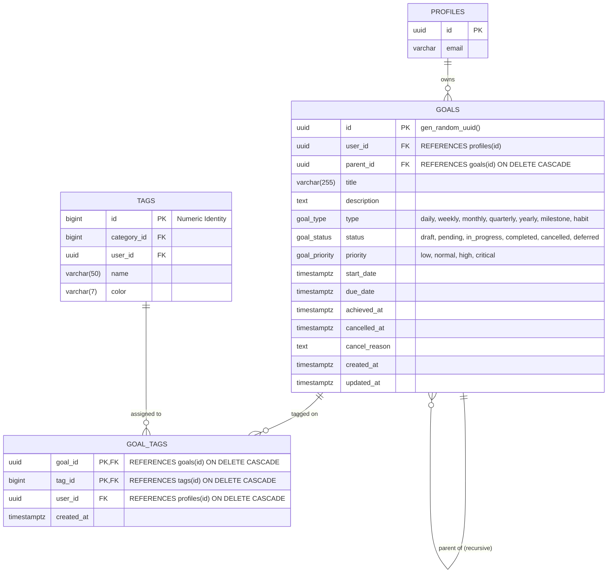

# Data Model: Goals & Objectives Ledger

## 1. Entity Relationship Diagram (ERD)



---

## 2. PostgreSQL DDL Schema

```sql
-- ==============================================================================
-- 1. ENUMS FOR GOALS
-- ==============================================================================
DO $$ BEGIN
    CREATE TYPE public.goal_type AS ENUM (
        'daily', 
        'weekly', 
        'monthly', 
        'quarterly', 
        'yearly', 
        'milestone', 
        'habit'
    );
EXCEPTION
    WHEN duplicate_object THEN null;
END $$;

DO $$ BEGIN
    CREATE TYPE public.goal_status AS ENUM (
        'draft', 
        'pending', 
        'in_progress', 
        'completed', 
        'cancelled', 
        'deferred'
    );
EXCEPTION
    WHEN duplicate_object THEN null;
END $$;

DO $$ BEGIN
    CREATE TYPE public.goal_priority AS ENUM (
        'low', 
        'normal', 
        'high', 
        'critical'
    );
EXCEPTION
    WHEN duplicate_object THEN null;
END $$;

-- ==============================================================================
-- 2. GOALS TABLE
-- ==============================================================================
CREATE TABLE IF NOT EXISTS public.goals (
    id UUID PRIMARY KEY DEFAULT gen_random_uuid(),
    user_id UUID NOT NULL REFERENCES public.profiles(id) ON DELETE CASCADE,
    parent_id UUID REFERENCES public.goals(id) ON DELETE CASCADE,
    
    -- Core fields
    title VARCHAR(255) NOT NULL,
    description TEXT,
    type public.goal_type NOT NULL DEFAULT 'daily',
    status public.goal_status NOT NULL DEFAULT 'draft',
    priority public.goal_priority NOT NULL DEFAULT 'normal',
    
    -- Scheduling & Lifecycle
    start_date TIMESTAMPTZ,
    due_date TIMESTAMPTZ,
    achieved_at TIMESTAMPTZ,
    cancelled_at TIMESTAMPTZ,
    cancel_reason TEXT,
    
    -- Metadata & Auditing
    created_at TIMESTAMPTZ NOT NULL DEFAULT NOW(),
    updated_at TIMESTAMPTZ NOT NULL DEFAULT NOW()
);

-- ==============================================================================
-- 3. GOAL TAGS JUNCTION TABLE (Universal Tagging Integration)
-- ==============================================================================
CREATE TABLE IF NOT EXISTS public.goal_tags (
    goal_id UUID NOT NULL REFERENCES public.goals(id) ON DELETE CASCADE,
    tag_id BIGINT NOT NULL REFERENCES public.tags(id) ON DELETE CASCADE,
    user_id UUID NOT NULL REFERENCES public.profiles(id) ON DELETE CASCADE,
    created_at TIMESTAMPTZ NOT NULL DEFAULT NOW(),

    PRIMARY KEY (goal_id, tag_id)
);
```

---

## 3. Performance Indexes

```sql
-- Single and composite indexes for fast lookups and hierarchical rollups
CREATE INDEX IF NOT EXISTS idx_goals_user_id ON public.goals(user_id);
CREATE INDEX IF NOT EXISTS idx_goals_parent_id ON public.goals(parent_id);
CREATE INDEX IF NOT EXISTS idx_goals_status_due ON public.goals(status, due_date);
CREATE INDEX IF NOT EXISTS idx_goals_priority ON public.goals(user_id, priority);
CREATE INDEX IF NOT EXISTS idx_goals_type ON public.goals(user_id, type);
CREATE INDEX IF NOT EXISTS idx_goals_created_at ON public.goals(user_id, created_at DESC);

-- Junction table index for reverse lookups (filtering goals by tag)
CREATE INDEX IF NOT EXISTS idx_goal_tags_tag_id ON public.goal_tags(tag_id, user_id);
CREATE INDEX IF NOT EXISTS idx_goal_tags_user_id ON public.goal_tags(user_id);
```

---

## 4. Row Level Security (RLS) Policies

```sql
-- Enable RLS
ALTER TABLE public.goals ENABLE ROW LEVEL SECURITY;
ALTER TABLE public.goal_tags ENABLE ROW LEVEL SECURITY;

-- Goals Policies (Strict Tenant Isolation)
CREATE POLICY "Users can view own goals"
    ON public.goals FOR SELECT
    USING (auth.uid() = user_id);

CREATE POLICY "Users can insert own goals"
    ON public.goals FOR INSERT
    WITH CHECK (auth.uid() = user_id);

CREATE POLICY "Users can update own goals"
    ON public.goals FOR UPDATE
    USING (auth.uid() = user_id)
    WITH CHECK (auth.uid() = user_id);

CREATE POLICY "Users can delete own goals"
    ON public.goals FOR DELETE
    USING (auth.uid() = user_id);

-- Goal Tags Junction Policies
CREATE POLICY "Users can view own goal tags"
    ON public.goal_tags FOR SELECT
    USING (auth.uid() = user_id);

CREATE POLICY "Users can manage own goal tags"
    ON public.goal_tags FOR ALL
    USING (auth.uid() = user_id)
    WITH CHECK (auth.uid() = user_id);
```

---

## 5. Triggers & Auto-Timestamps

```sql
-- Trigger for automatic updated_at timestamp maintenance
CREATE TRIGGER set_goals_updated_at
    BEFORE UPDATE ON public.goals
    FOR EACH ROW
    EXECUTE FUNCTION public.handle_updated_at();
```

---

## 6. Zod Validation Schemas (Client & Server)

```typescript
import { z } from "zod";

export const goalTypeEnum = z.enum([
  "daily",
  "weekly",
  "monthly",
  "quarterly",
  "yearly",
  "milestone",
  "habit",
]);

export const goalStatusEnum = z.enum([
  "draft",
  "pending",
  "in_progress",
  "completed",
  "cancelled",
  "deferred",
]);

export const goalPriorityEnum = z.enum([
  "low",
  "normal",
  "high",
  "critical",
]);

// Create Goal Schema
export const createGoalSchema = z.object({
  title: z.string().trim().min(1, "Title is required").max(255, "Maximum 255 characters"),
  description: z.string().trim().nullable().optional(),
  parent_id: z.string().uuid("Invalid parent goal UUID").nullable().optional(),
  type: goalTypeEnum.default("daily"),
  status: goalStatusEnum.default("draft"),
  priority: goalPriorityEnum.default("normal"),
  start_date: z.string().datetime({ offset: true }).nullable().optional(),
  due_date: z.string().datetime({ offset: true }).nullable().optional(),
  tag_ids: z.array(z.number().int().positive()).optional(),
});

// Update Goal Schema
export const updateGoalSchema = createGoalSchema.partial().extend({
  achieved_at: z.string().datetime({ offset: true }).nullable().optional(),
  cancelled_at: z.string().datetime({ offset: true }).nullable().optional(),
  cancel_reason: z.string().trim().nullable().optional(),
});

// Status Transition Schema
export const updateGoalStatusSchema = z.object({
  status: goalStatusEnum,
  cancel_reason: z.string().trim().nullable().optional(),
});

// Goal Filter Schema
export const goalFilterSchema = z.object({
  parent_id: z.string().uuid().nullable().optional(),
  type: goalTypeEnum.optional(),
  status: goalStatusEnum.optional(),
  priority: goalPriorityEnum.optional(),
  tag_ids: z.array(z.number().int().positive()).optional(),
  search: z.string().trim().optional(),
  include_subgoals: z.boolean().default(true),
});
```
