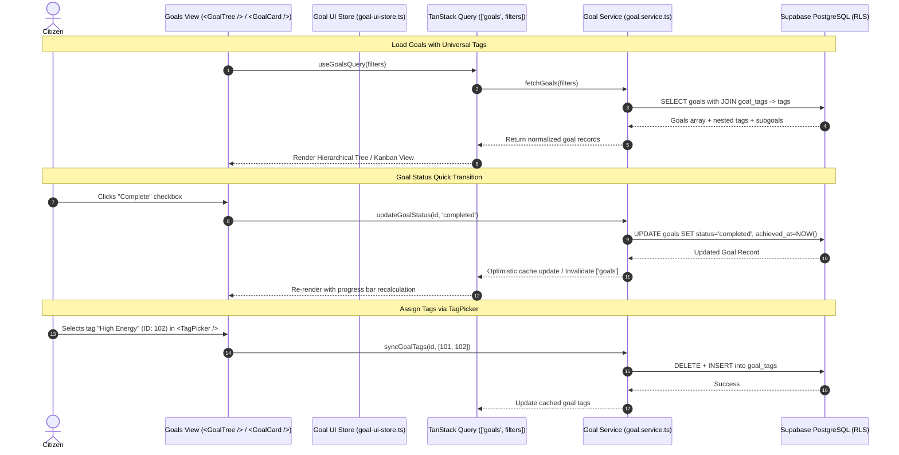

# Technical Design Document (TDD): Goals & Objectives Architecture

## 1. System Architecture & Component Mapping



---

## 2. Directory & Component Hierarchy

```text
src/
├── app/
│   └── (dashboard)/
│       └── goals/
│           ├── page.tsx                           # Goals dashboard route & layout
│           ├── loading.tsx                        # Tactile skeleton loader
│           └── components/
│               ├── goal-header.tsx                # Title, view switcher (Tree/Board/List), "New Goal" CTA
│               ├── goal-filter-toolbar.tsx        # Multi-attribute filter bar (tags, status, priority, type)
│               ├── goal-tree-view.tsx             # Collapsible recursive parent-child goal tree (< 300 lines)
│               ├── goal-tree-node.tsx             # Single node rendering priority badge, status toggle, tags
│               ├── goal-board-view.tsx            # Kanban status columns view
│               └── goal-detail-drawer.tsx         # Slide-over inspector for sub-goals, audit timeline, notes
├── components/
│   └── goals/
│       ├── goal-type-badge.tsx                    # Visual badge for daily/weekly/monthly/milestone/habit
│       ├── goal-priority-badge.tsx                # Tactile priority pill (Critical, High, Normal, Low)
│       ├── goal-status-badge.tsx                  # Status pill with color indicators
│       ├── goal-progress-bar.tsx                  # Sub-goal completion progress indicator
│       ├── goal-form-dialog.tsx                   # Modal dialog for creating/editing root or sub-goals
│       └── goal-cancel-dialog.tsx                 # Reason prompt dialog when cancelling a goal
├── services/
│   └── goal.service.ts                            # Direct Supabase query builder functions
├── hooks/
│   └── queries/
│       └── use-goals.ts                           # React Query hooks (useGoals, useGoal, mutations)
├── stores/
│   └── goal-ui-store.ts                           # Pure transient UI store (activeView, expandedGoalIds, activeFilter)
└── types/
    └── goal.types.ts                              # Domain interfaces, enums, and DTOs
```

---

## 3. State Management Boundaries

| State Layer | Tool / Mechanism | Scope | Examples |
|---|---|---|---|
| **Server State** | TanStack Query v5 (`useGoals`, `useGoal`) | Cache & Sync | Goals list, sub-goal hierarchies, goal tags, mutation optimisms |
| **Transient UI State** | Zustand (`useGoalUIStore`) | Client-Only Memory | View mode (`tree` / `board` / `list`), expanded node IDs in tree, search query text |
| **Form State** | React Hook Form + Zod | Component Local | Create/edit goal dialog inputs, cancel reason modal input |
| **Tag Taxonomy** | TanStack Query (`['tag-categories', 'goals']`) | Shared Query Cache | Categorized tag list loaded into `<TagPicker />` combobox |

---

## 4. Performance & Rendering Guardrails

1. **No Blur Filters**: Strictly utilize solid background tones (`hsl(var(--card))`), alpha transparencies, and hardware-accelerated CSS `box-shadow` borders for hover and focus states.
2. **Recursive Rendering Optimization**: Goal tree nodes memoize sub-tree expansion states to prevent full tree re-renders on leaf status toggles.
3. **Optimistic Updates**: Toggling goal completion updates the local query cache immediately before the network roundtrip finishes.
