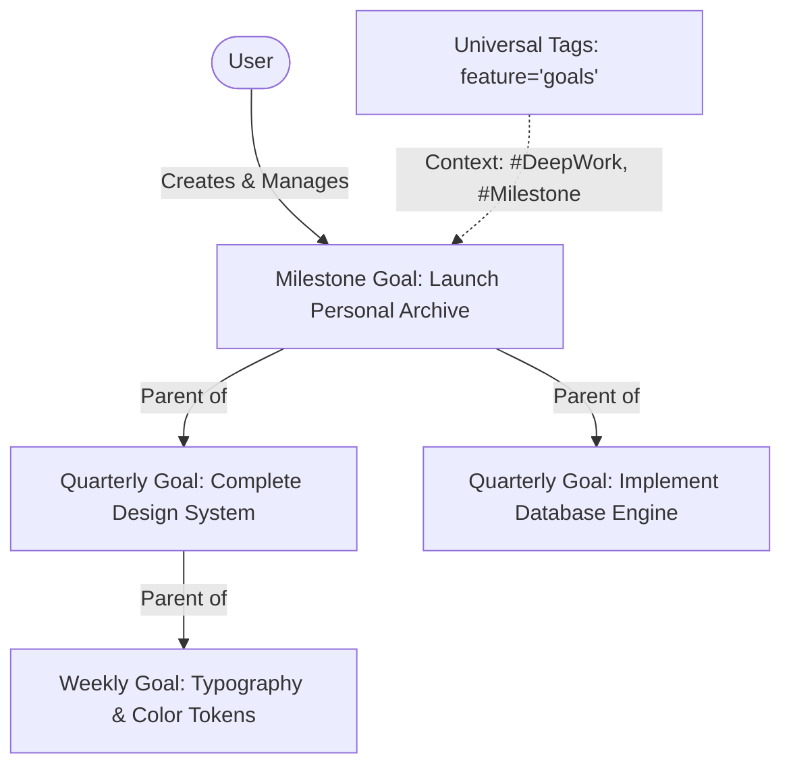
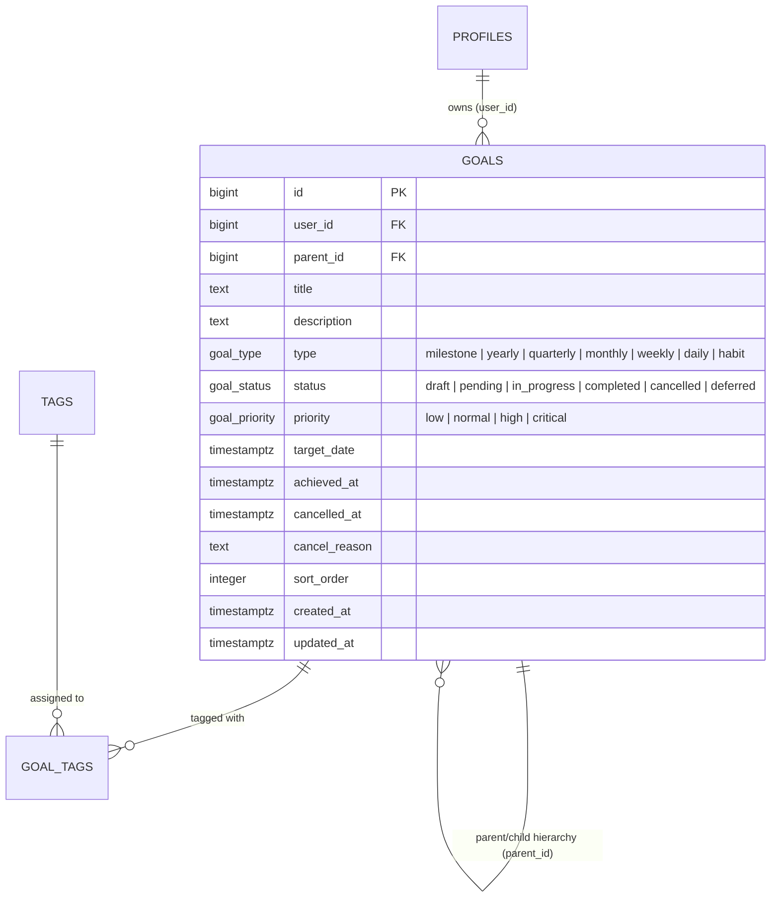

# Feature Spec: Goals & Strategic Objectives

> [!NOTE]
> Living feature specification for the Goals ledger in The Commons. Automatically rendered at `/dev/document`.

---

## 1. User Story & UX Flow

- **Problem Statement**: Users need a structured, multi-tier hierarchical system to decompose strategic initiatives into milestone deliverables, yearly/quarterly themes, weekly sprints, and track execution lifecycle states.
- **Target Persona**: All authenticated members.

### Primary Interaction Flows:
1. **Goal Creation & Hierarchy**:
   - User sets a goal title, goal type (`milestone`, `yearly`, `quarterly`, `monthly`, `weekly`, `daily`, `habit`), and target timeframe.
   - User can nest child goals under parent initiatives via `parent_id`.
2. **Lifecycle Tracking**:
   - Updates status: `draft` $\rightarrow$ `pending` $\rightarrow$ `in_progress` $\rightarrow$ `completed` / `cancelled` / `deferred`.
   - Records `achieved_at` or `cancelled_at` with optional reasoning.
3. **Priority & Target Metrics**:
   - Assigns priority: `low`, `normal`, `high`, `critical`.
   - Tracks target value / current progress percentage.
4. **Universal Tags Integration**:
   - Tags goals via `goal_tags` with the shared taxonomy (`feature = 'goals'`).

---

## 2. Database Schema & RLS Model

- **Primary Entities**: `public.goals`, `public.goal_tags`, `public.tags`, `public.tag_categories`.
- **Identity Key Standard**: `id bigint generated by default as identity primary key`.
- **Source of Truth**: Auto-generated in [`src/lib/types/database.types.ts`](file:///Users/daviditc/Documents/personal_projects/The-Commons/src/lib/types/database.types.ts) and visualizable via the `⚡ Live Schema` tab.

### Row Level Security (RLS) Rules:
- All queries and mutations enforce `using (user_id = (select id from public.profiles where auth_user_id = auth.uid()))`.
- Strict user isolation.

---

## 3. Routes & Component Matrix

| Route / Component Path | Type | Responsibility |
| :--- | :--- | :--- |
| `src/routes/(app)/goals/+page.svelte` | Page View | Interactive goal ledger, hierarchy tree, filter tabs |
| `src/routes/(app)/goals/+page.server.ts` | Loader & Actions | Loads goals tree and handles mutations |
| `src/lib/components/TagManagementSidePanel.svelte` | Side Panel | Shared tag categorization scoped to `goals` |

---

## 4. Acceptance Criteria & Invariants

- [ ] **Recursive Tree Navigation**: Child goals render nested beneath parent milestones with collapsible branches.
- [ ] **State Machine Invariants**: Marking a goal completed sets `achieved_at = now()`; cancelling sets `cancelled_at`.
- [ ] **Integer Identity Keys**: All goal IDs and references use standard `bigint` identity keys.
- [ ] **Zero Cross-Tenant Leakage**: RLS guarantees authenticated users can only view and modify their own goals.
