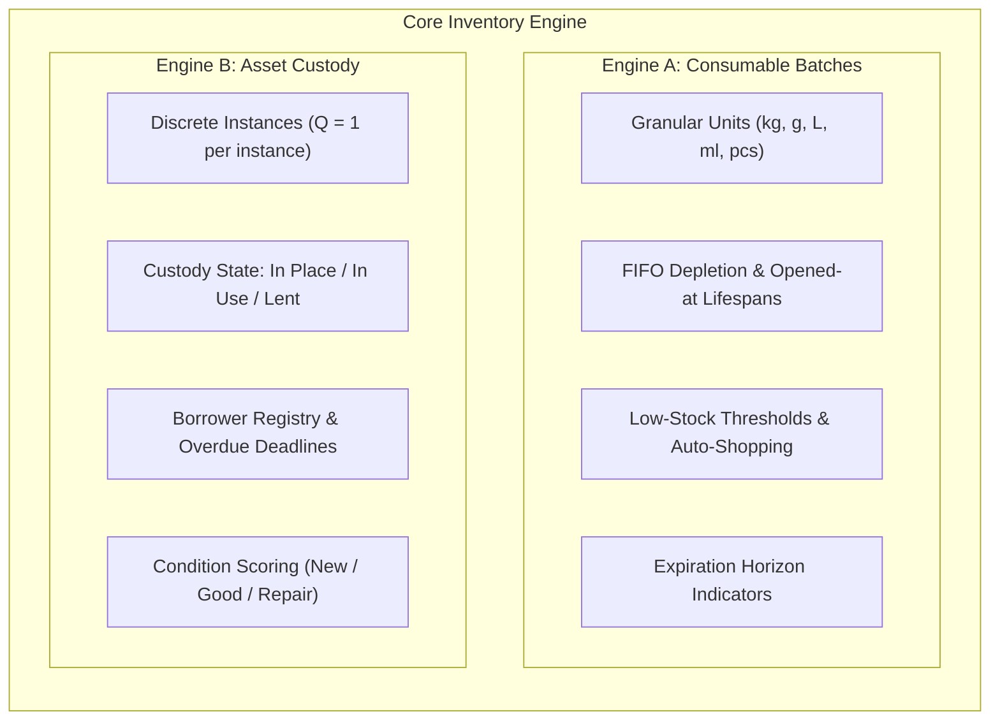
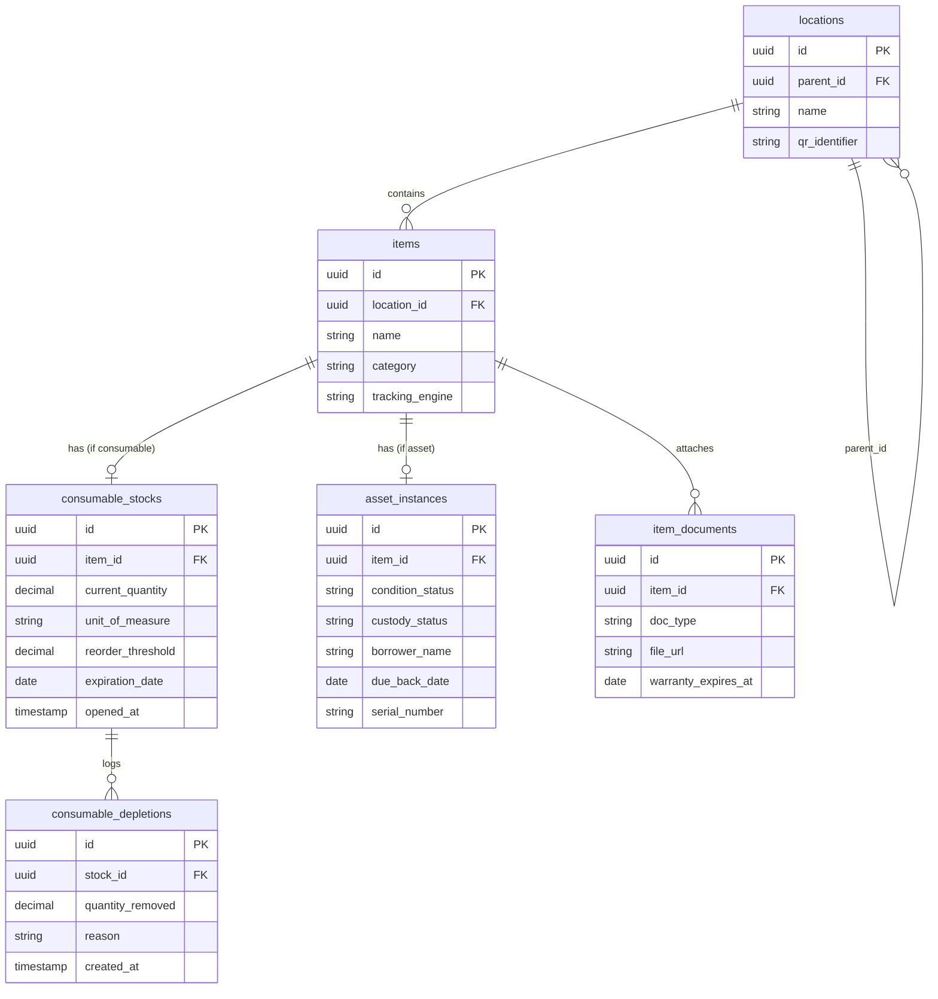

# PRD: HomeOps — Modular Home Inventory & Resource Management System

## 1. Executive Summary & Core Architecture
Managing a household requires handling two fundamentally incompatible operational models:

1. **Consumables & Depletables:** Continuous stock depletion, fractional quantities, batch dates, expiration windows, and auto-restock triggers.
2. **Tracked Durables & Assets:** Discrete unit ownership ($Q = 1$), physical custody, lending logs, condition maintenance, and warranty/stub indexing.

HomeOps unifies both models under an explicit **Dual-Engine Architecture**, backed by hierarchical location mapping and document digitization.



---

## 2. Complete Household Taxonomy & Schema Constraints

Every household item maps to one of six standardized categories, which determine its default engine, units, and verification logic:

| Category | Default Engine | Unit Format | Key Tracking Attributes |
| :--- | :--- | :--- | :--- |
| **1. Spices & Seasonings** | Consumable | `g`, `oz`, `sealed/opened` | Sealed vs. open state, aroma potency horizon, shaker vs. refill pouch |
| **2. Pantry & Food Staples** | Consumable | `kg`, `g`, `L`, `ml`, `packs` | Expiration date, lot batch, storage environment (Pantry, Cold, Dark/Dry for tubers) |
| **3. Cleaning & Laundry** | Consumable / Hybrid | `ml`, `L`, `pcs`, `packs` | Hazard/corrosive flags, refill jug vs. dispenser association, hardware durables (mops, buckets) |
| **4. Tools & Hardware** | Asset / Consumable | `units` or `pcs count` | **Tools:** Custody, borrower, condition.<br>**Fasteners/Tape:** Piece count, metric/imperial size |
| **5. Electrical & Backup** | Asset / Consumable | `pcs` or `individual tool` | **Batteries:** Chemistry, voltage, shelf-life.<br>**Gear:** Tester calibration, watt rating, recharge cycle |
| **6. Health & Emergency** | Consumable / Asset | `tablets`, `dressings`, `unit` | Hard expiration cutoff, critical minimum alert floor, fire extinguisher inspection date |

---

## 3. Functional Requirements & Feature Sets

### A. Intake, Categorization & Storage Hierarchy
- **4-Tier Recursive Location Node Tree:**
  $$\text{Zone (Room/Area)} \longrightarrow \text{Sub-Zone (Cabinet/Workbench)} \longrightarrow \text{Container (Bin/Drawer)} \longrightarrow \text{Slot (Divided Compartment)}$$
- Every physical container can generate a printable, machine-readable QR code.
- **Intake Classifier:** When adding an item, the interface prompts for engine assignment:
  - **Consumable:** Enforces `initial_quantity`, `unit_of_measure`, `reorder_threshold`, and `expiration_date`.
  - **Asset:** Enforces `condition_status`, `location_id`, optional `serial_number`, and `replacement_cost`.

### B. Daily Operations & Usage Workflows
- **One-Tap Depletion Dashboard (Consumables):**
  - Quick-action buttons: `-1`, `-2`, `-25%`, `Mark Empty`.
  - Auto-Restock Pipeline: As soon as `current_quantity <= reorder_threshold`, the item automatically surfaces on the consolidated **Shopping List View**.
- **Custody & Loan Workflow (Assets):**
  - Status options: `In Storage`, `Active Project`, `Lent Out`.
  - Check-out modal: Captures `borrower_name`, `borrower_contact`, `loan_date`, and `expected_return_date`.
  - Overdue asset alerts on the primary dashboard.

### C. Cross-Domain Dependency Linking
- Durable assets can declare formal links to required consumable stocks:
  - *Utility Knife* (Asset) $\longrightarrow$ linked to *Replacement Trapezoid Blades* (Consumable).
  - *Digital Multimeter* (Asset) $\longrightarrow$ linked to *9V Alkaline Battery* (Consumable).
  - *Smoke Alarm* (Asset) $\longrightarrow$ linked to *9V Lithium Battery* (Consumable).
  - *Flashlight* (Asset) $\longrightarrow$ linked to *18650 / AAA Batteries* (Consumable).

### D. Document, Receipt & Stub Digitization
- **Attachment Engine:** Support camera capture or PDF/image upload for paper stubs, retail cash receipts, and operating manuals.
- **Metadata Association:** Attachments link either to a specific item instance (e.g., multimeter warranty receipt) or a multi-item purchase transaction.
- **Warranty Alerts:** Automatic push notification 30 days prior to manufacturer warranty expiry.

---

## 4. Relational Data Architecture



---

## 5. UI/UX Screen Specifications

1. **Global Dashboard:**
   - High-level summary cards: *Items Low on Stock*, *Perishables Expiring in $\le$ 7 Days*, *Tools Currently Lent Out*.
   - Quick-Action Bar: Instant Barcode/QR Scan, Quick Deplete, Quick Add.

2. **Unified Inventory Matrix:**
   - Tabbed interface: `All Items` | `Pantry & Consumables` | `Tools & Durables` | `Restock List`.
   - Real-time search by item name, storage room, shelf, or category tags.

3. **Container Audit View:**
   - Activated by scanning a physical bin's QR code.
   - Loads an instant verification checklist of all items mapped to that `location_id`.
   - One-tap confirmation: *"All items verified"* or *"Flag missing"*.

4. **Item Detail / Stub Vault:**
   - Shows item metadata, current location path, linked consumables/durables, and an image gallery of uploaded receipts and warranty papers.

---

## 6. Implementation Phasing & Acceptance Criteria

```
Phase 1: Dual-Engine MVP Core (Weeks 1–3)
├── Setup PostgreSQL relational schema (locations, items, consumable_stocks, asset_instances)
├── Hierarchical location tree CRUD (Room -> Cabinet -> Bin)
├── Item creation interface with dynamic engine toggle (Consumable vs. Asset)
└── One-touch quantity adjustment with automated Low Stock view

Phase 2: Assets, Lending & Paper Stubs (Weeks 4–5)
├── Tool lending workflow (custody states, borrower details, due dates)
├── Document attachment pipeline (image upload for paper receipts, warranty cards)
├── Expiration tracking (pantry foods, medical supplies, battery shelf life)
└── Item dependency pairing (e.g., Tool -> Required Battery/Blade)

Phase 3: Hardware & QR Workflows (Weeks 6–7)
├── In-app camera QR code generator and reader
├── Printable QR sticker sheets for physical bins and shelves
├── Location audit cycle-count mode via QR scan
└── CSV/JSON export and offline backup synchronization
```

### Acceptance Test Scenarios
1. **Consumable Threshold Test:** Adding a pack of 12 AA batteries with `reorder_threshold = 3`. Decrementing stock to 2 units must immediately render the item in the active Restock/Shopping List view.
2. **Asset Lending Test:** Marking a hammer as `Lent Out` prompts for borrower name and return date. The item's location status must update to `With Borrower`, without modifying any numeric quantities.
3. **Stub Linkage Test:** Uploading an image of a purchase receipt against a cordless drill stores the document record with document type `warranty`, calculates warranty expiration, and exposes the image in the item's detail view.
