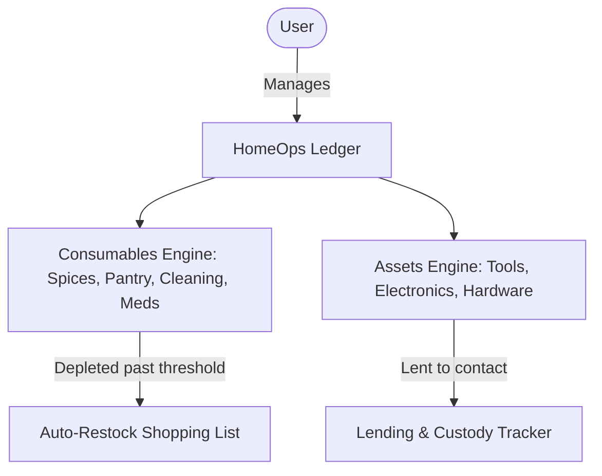
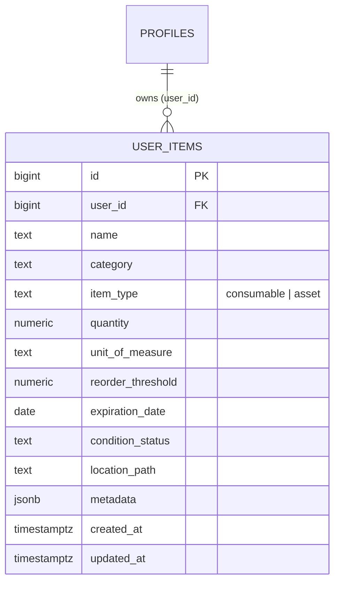

# Feature Spec: HomeOps — Household Inventory & Asset Ledger

> [!NOTE]
> Living feature specification for HomeOps (Consumables & Asset Ledger) in The Commons. Automatically rendered at `/dev/document`.

---

## 1. User Story & UX Flow

- **Problem Statement**: Household operations require handling two distinct paradigms: (1) Consumable stock depletion (quantities, expiration dates, auto-shopping restock) and (2) Durable asset tracking (custody, lending logs, condition, warranties).
- **Target Persona**: Household managers and members.

### Primary Interaction Flows:
1. **Quick-Add Intake**:
   - Classifies item into **Consumables** (units, batches, expiration date, low-stock threshold) or **Assets** (serial no, condition, location, borrower).
2. **One-Tap Depletion**:
   - Quick depletion actions (`-1`, `-25%`, `Mark Empty`). Falling below threshold auto-adds item to the shopping list.
3. **Hierarchical Location Hierarchy**:
   - 4-Tier physical organization: $\text{Zone (Room)} \rightarrow \text{Cabinet / Sub-Zone} \rightarrow \text{Bin / Container} \rightarrow \text{Slot}$.
4. **Lending & Custody Tracker**:
   - Logs items lent out to contacts with expected return dates.

---

## 2. Database Schema & RLS Model

- **Primary Entities**: `public.user_items`, `public.item_locations` (or stored metadata in `user_items`).
- **Identity Key Standard**: `id bigint generated by default as identity primary key`.
- **Source of Truth**: Auto-generated in [`src/lib/types/database.types.ts`](file:///Users/daviditc/Documents/personal_projects/The-Commons/src/lib/types/database.types.ts) and visualizable via the `⚡ Live Schema` tab.

### Row Level Security (RLS) Rules:
- Enforces strict user isolation: `using (user_id = (select id from public.profiles where auth_user_id = auth.uid()))`.

---

## 3. Routes & Component Matrix

| Route / Component Path | Type | Responsibility |
| :--- | :--- | :--- |
| `src/routes/(app)/homeops/+page.svelte` | Page View | Inventory dashboard, consumables depletion, asset ledger, shopping list |
| `src/routes/(app)/homeops/+page.server.ts` | Loader & Actions | Loads user items and handles quantity adjustments |

---

## 4. Acceptance Criteria & Invariants

- [ ] **Auto-Restock Trigger**: Consumable items with `quantity <= reorder_threshold` automatically appear in the shopping view.
- [ ] **Dual-Engine Model**: UI correctly toggles between unit-based depletion and single-unit asset custody tracking.
- [ ] **Integer Identity Keys**: Uses `bigint` keys matching database standards.
