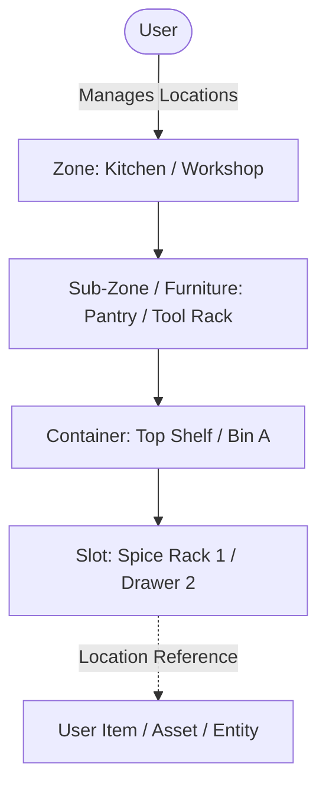
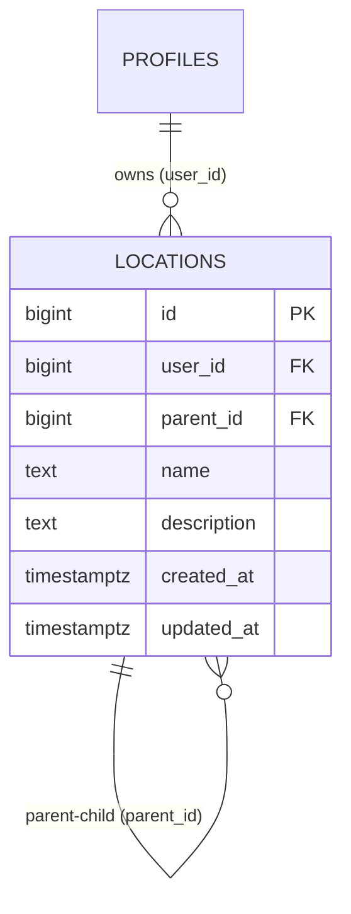

# Feature Spec: Universal Location Tree & Spatial Hierarchy

> [!NOTE]
> Living feature specification for the recursive location hierarchy in The Commons. Available cross-feature for HomeOps, Asset Ledgers, Storage, and Entity Management. Rendered at `/dev/document`.

---

## 1. User Story & UX Flow

- **Problem Statement**: Multiple features (HomeOps, Hardware/Asset Ledgers, Inventory, Workspace/Studio setup) require hierarchical spatial organization (e.g. `Room / Zone -> Cabinet / Rack -> Shelf / Container -> Slot / Bin`) without hardcoding nesting depths or duplicating location tables per domain.
- **Target Persona**: All members organizing spaces, assets, items, or equipment.

### Primary Interaction Flows:
1. **Hierarchical Management**:
   - Create parent zones and nest child locations recursively (`parent_id`).
   - Breadcrumb navigation and path resolution (e.g. `Garage > Workbench > Drawer 1`).
2. **Cross-Feature Reusability**:
   - Entities reference `location_id bigint references public.locations(id)`.
3. **Recursive Cleanup**:
   - Deleting a parent location cleanly cascades (`on delete cascade`) or re-parents child nodes based on user intent.

---

## 2. Database Schema & RLS Model

- **Primary Entity**: `public.locations`
- **Identity Key Standard**: `id bigint generated by default as identity primary key`.
- **Source of Truth**: Auto-generated in [`src/lib/types/database.types.ts`](file:///Users/daviditc/Documents/personal_projects/The-Commons/src/lib/types/database.types.ts) and visualizable via the `⚡ Live Schema` tab.

### Row Level Security (RLS) Rules:
- Strictly isolated per user: `using (user_id = (select id from public.profiles where auth_user_id = auth.uid()))`.

---

## 3. Routes & Component Matrix

| Route / Component Path | Type | Responsibility |
| :--- | :--- | :--- |
| `src/lib/components/LocationSelector.svelte` | Shared UI | Hierarchical tree picker & breadcrumb resolver |
| `supabase/migrations/20261005000002_create_locations_schema.sql` | Migration | DDL table definitions, indexes, RLS policies |

---

## 4. Acceptance Criteria & Invariants

- [ ] **Recursive Tree Integrity**: `parent_id` points to a valid `locations.id` owned by the same user.
- [ ] **Cascade Deletion**: Removing a parent location cascades to child sub-locations.
- [ ] **Integer Identity Standard**: Uses `bigint` auto-incrementing identity keys conforming to project standards.
