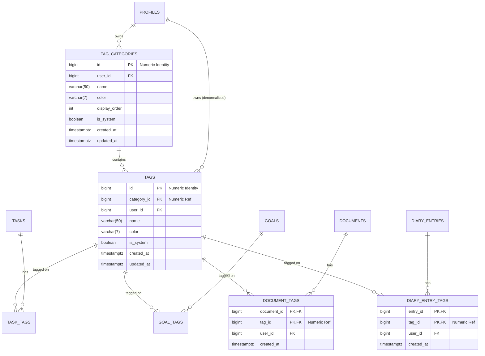

# Data Model: Tag Categories & Universal Tagging System

## 1. Entity Relationship Diagram (ERD)



---

## 2. PostgreSQL DDL Schema

```sql
-- ==============================================================================
-- 1. TAG CATEGORIES TABLE (Numeric ID)
-- ==============================================================================
CREATE TABLE IF NOT EXISTS public.tag_categories (
    id BIGINT GENERATED BY DEFAULT AS IDENTITY PRIMARY KEY,
    user_id BIGINT NOT NULL REFERENCES public.profiles(id) ON DELETE CASCADE,
    feature TEXT NOT NULL DEFAULT 'general',
    name VARCHAR(50) NOT NULL,
    color VARCHAR(7) NOT NULL DEFAULT '#6B7280',
    display_order INT NOT NULL DEFAULT 0,
    is_system BOOLEAN NOT NULL DEFAULT false,
    created_at TIMESTAMPTZ NOT NULL DEFAULT NOW(),
    updated_at TIMESTAMPTZ NOT NULL DEFAULT NOW(),

    -- Ensure a user cannot create duplicate category names within the same feature
    CONSTRAINT uq_user_feature_category_name UNIQUE (user_id, feature, name)
);

-- ==============================================================================
-- 2. TAGS TABLE (Numeric ID)
-- ==============================================================================
CREATE TABLE IF NOT EXISTS public.tags (
    id BIGINT GENERATED BY DEFAULT AS IDENTITY PRIMARY KEY,
    category_id BIGINT NOT NULL REFERENCES public.tag_categories(id) ON DELETE CASCADE,
    user_id BIGINT NOT NULL REFERENCES public.profiles(id) ON DELETE CASCADE,
    name VARCHAR(50) NOT NULL,
    color VARCHAR(7) DEFAULT NULL, -- NULL means inherit category color
    is_system BOOLEAN NOT NULL DEFAULT false,
    created_at TIMESTAMPTZ NOT NULL DEFAULT NOW(),
    updated_at TIMESTAMPTZ NOT NULL DEFAULT NOW(),

    -- Ensure tag names are unique within a specific category for a given user
    CONSTRAINT uq_user_tag_in_category UNIQUE (category_id, name)
);

-- ==============================================================================
-- 3. JUNCTION TABLE: DOCUMENT TAGS
-- ==============================================================================
CREATE TABLE IF NOT EXISTS public.document_tags (
    document_id BIGINT NOT NULL,
    tag_id BIGINT NOT NULL REFERENCES public.tags(id) ON DELETE CASCADE,
    user_id BIGINT NOT NULL REFERENCES public.profiles(id) ON DELETE CASCADE,
    created_at TIMESTAMPTZ NOT NULL DEFAULT NOW(),

    PRIMARY KEY (document_id, tag_id)
);

-- ==============================================================================
-- 4. JUNCTION TABLE: DIARY ENTRY TAGS
-- ==============================================================================
CREATE TABLE IF NOT EXISTS public.diary_entry_tags (
    entry_id BIGINT NOT NULL REFERENCES public.diary_entries(id) ON DELETE CASCADE,
    tag_id BIGINT NOT NULL REFERENCES public.tags(id) ON DELETE CASCADE,
    user_id BIGINT NOT NULL REFERENCES public.profiles(id) ON DELETE CASCADE,
    created_at TIMESTAMPTZ NOT NULL DEFAULT NOW(),

    PRIMARY KEY (entry_id, tag_id)
);
```

---

## 3. Performance Indexes

```sql
CREATE INDEX IF NOT EXISTS idx_tag_categories_user_order 
    ON public.tag_categories(user_id, display_order ASC, name ASC);

CREATE INDEX IF NOT EXISTS idx_tags_category_id 
    ON public.tags(category_id);

CREATE INDEX IF NOT EXISTS idx_tags_user_id 
    ON public.tags(user_id, name ASC);

CREATE INDEX IF NOT EXISTS idx_document_tags_tag_id 
    ON public.document_tags(tag_id, user_id);

CREATE INDEX IF NOT EXISTS idx_diary_entry_tags_tag_id 
    ON public.diary_entry_tags(tag_id, user_id);
```

---

## 4. Row Level Security (RLS) Policies

```sql
ALTER TABLE public.tag_categories ENABLE ROW LEVEL SECURITY;
ALTER TABLE public.tags ENABLE ROW LEVEL SECURITY;
ALTER TABLE public.document_tags ENABLE ROW LEVEL SECURITY;
ALTER TABLE public.diary_entry_tags ENABLE ROW LEVEL SECURITY;

-- Tag Categories Policies
CREATE POLICY "Users can view own tag categories"
    ON public.tag_categories FOR SELECT
    USING (user_id = (select p.id from public.profiles p where p.auth_user_id = auth.uid()));

CREATE POLICY "Users can insert own tag categories"
    ON public.tag_categories FOR INSERT
    WITH CHECK (user_id = (select p.id from public.profiles p where p.auth_user_id = auth.uid()));

CREATE POLICY "Users can update own tag categories"
    ON public.tag_categories FOR UPDATE
    USING (user_id = (select p.id from public.profiles p where p.auth_user_id = auth.uid()))
    WITH CHECK (user_id = (select p.id from public.profiles p where p.auth_user_id = auth.uid()));

CREATE POLICY "Users can delete own tag categories"
    ON public.tag_categories FOR DELETE
    USING (user_id = (select p.id from public.profiles p where p.auth_user_id = auth.uid()));

-- Tags Policies
CREATE POLICY "Users can view own tags"
    ON public.tags FOR SELECT
    USING (user_id = (select p.id from public.profiles p where p.auth_user_id = auth.uid()));

CREATE POLICY "Users can insert own tags"
    ON public.tags FOR INSERT
    WITH CHECK (user_id = (select p.id from public.profiles p where p.auth_user_id = auth.uid()));

CREATE POLICY "Users can update own tags"
    ON public.tags FOR UPDATE
    USING (user_id = (select p.id from public.profiles p where p.auth_user_id = auth.uid()) AND is_system = false)
    WITH CHECK (user_id = (select p.id from public.profiles p where p.auth_user_id = auth.uid()) AND is_system = false);

CREATE POLICY "Users can delete own tags"
    ON public.tags FOR DELETE
    USING (user_id = (select p.id from public.profiles p where p.auth_user_id = auth.uid()) AND is_system = false);

-- Document Tags Junction Policies
CREATE POLICY "Users can view own document tags"
    ON public.document_tags FOR SELECT
    USING (user_id = (select p.id from public.profiles p where p.auth_user_id = auth.uid()));

CREATE POLICY "Users can manage own document tags"
    ON public.document_tags FOR ALL
    USING (user_id = (select p.id from public.profiles p where p.auth_user_id = auth.uid()))
    WITH CHECK (user_id = (select p.id from public.profiles p where p.auth_user_id = auth.uid()));

-- Diary Entry Tags Junction Policies
CREATE POLICY "Users can view own diary entry tags"
    ON public.diary_entry_tags FOR SELECT
    USING (user_id = (select p.id from public.profiles p where p.auth_user_id = auth.uid()));

CREATE POLICY "Users can manage own diary entry tags"
    ON public.diary_entry_tags FOR ALL
    USING (user_id = (select p.id from public.profiles p where p.auth_user_id = auth.uid()))
    WITH CHECK (user_id = (select p.id from public.profiles p where p.auth_user_id = auth.uid()));
```

---

## 5. Zod Validation Schemas (Client & Server)

```typescript
import { z } from "zod";

export const hexColorSchema = z
  .string()
  .regex(/^#([0-9A-F]{3}){1,2}$/i, "Must be a valid hex color code (e.g. #6B7280)");

// Tag Category Schemas
export const createTagCategorySchema = z.object({
  feature: z.string().trim().min(1).default("general"),
  name: z.string().trim().min(1, "Name is required").max(50, "Maximum 50 characters"),
  color: hexColorSchema.default("#6B7280"),
  display_order: z.number().int().nonnegative().default(0),
});

export const updateTagCategorySchema = createTagCategorySchema.partial();

// Tag Schemas (Numeric Category ID)
export const createTagSchema = z.object({
  category_id: z.number().int().positive("Invalid numeric category ID"),
  name: z.string().trim().min(1, "Tag name is required").max(50, "Maximum 50 characters"),
  color: hexColorSchema.nullable().optional(),
});

export const updateTagSchema = z.object({
  name: z.string().trim().min(1).max(50).optional(),
  color: hexColorSchema.nullable().optional(),
  category_id: z.number().int().positive().optional(),
});

// Entity Assignment Schema (Numeric Tag IDs & Entity IDs)
export const syncEntityTagsSchema = z.object({
  entity_id: z.number().int().positive("Invalid entity numeric ID"),
  entity_type: z.enum(["document", "diary_entry"]),
  tag_ids: z.array(z.number().int().positive("Invalid numeric tag ID")),
});
```
