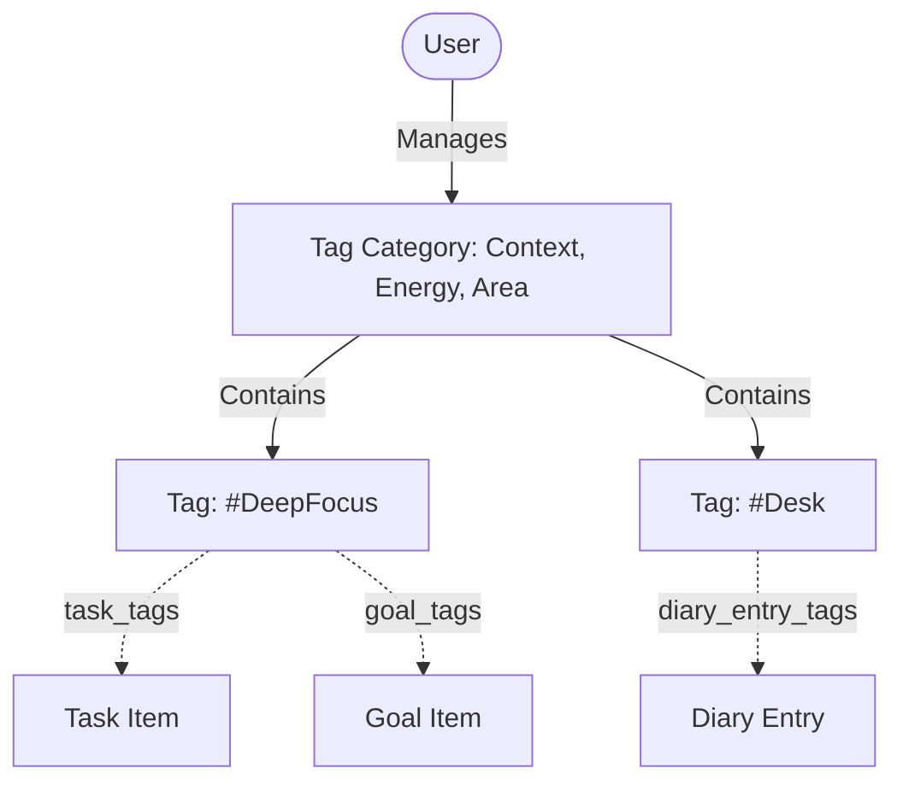
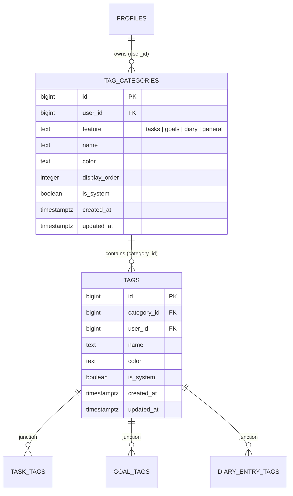

# Feature Spec: Universal Tagging System

> [!NOTE]
> Living feature specification for the shared cross-feature Tag Taxonomy in The Commons. Automatically rendered at `/dev/document`.

---

## 1. User Story & UX Flow

- **Problem Statement**: Multiple features (Tasks, Goals, Daily Diary, Documents, HomeOps) require flexible, multi-dimensional categorization (e.g. Context, Energy Level, Life Area, Project) without duplicating tag tables per module.
- **Target Persona**: All authenticated members.

### Primary Interaction Flows:
1. **Category & Tag Management**:
   - User opens `TagManagementSidePanel.svelte` from any supported feature page.
   - User creates/edits custom categories with custom hex accent colors.
   - User adds, edits, or removes tags within categories.
2. **Feature Scoping**:
   - Categories can be scoped to a specific feature (`feature = 'tasks'`, `'goals'`, `'diary'`) or shared across features (`'general'`).
3. **Automatic System Provisioning**:
   - On first load, default categories (`Context`, `Energy & Focus`, `Domain`) are provisioned seamlessly.

---

## 2. Database Schema & RLS Model

- **Primary Entities**: `public.tag_categories`, `public.tags`, and junction tables (`task_tags`, `goal_tags`, `diary_entry_tags`, `entity_tags`).
- **Identity Key Standard**: `id bigint generated by default as identity primary key`.
- **Source of Truth**: Auto-generated in [`src/lib/types/database.types.ts`](file:///Users/daviditc/Documents/personal_projects/The-Commons/src/lib/types/database.types.ts) and visualizable via the `⚡ Live Schema` tab.

### Row Level Security (RLS) Rules:
- Enforces `using (user_id = (select id from public.profiles where auth_user_id = auth.uid()) or is_system = true)`.
- System tags/categories can be viewed by all members; user custom tags are strictly isolated.

---

## 3. Routes & Component Matrix

| Route / Component Path | Type | Responsibility |
| :--- | :--- | :--- |
| `src/lib/components/TagManagementSidePanel.svelte` | Side Panel | Complete tag & category creation, editing, color picking, and deletion |
| `src/lib/types/tags.ts` | Types | TypeScript interfaces for `Tag`, `TagCategory`, and `FeatureType` |
| `supabase/schema/tables/tags.sql` | Schema | DDL table definitions and indexes |

---

## 4. Acceptance Criteria & Invariants

- [ ] **Cascade Deletion**: Deleting a category prompts a confirmation dialog and deletes all child tags cleanly.
- [ ] **Color Contrast**: Custom category colors dynamically format tag pills with readable contrast.
- [ ] **Cross-Feature Reusability**: The same `TagManagementSidePanel` component can be mounted on any feature page passing `feature="tasks" | "goals" | "diary"`.
- [ ] **Type Alignment**: Uses `bigint` numeric IDs matching generated database types.
