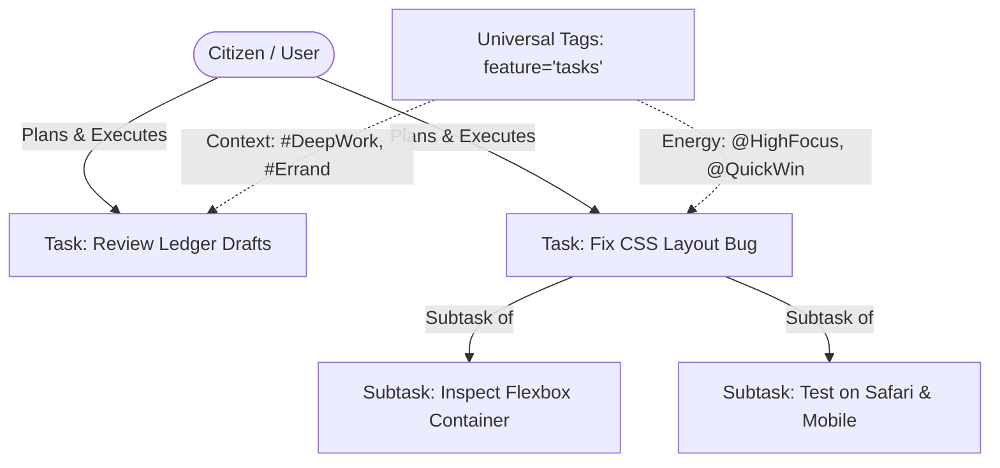

# PRD: Day-to-Day Task Ledger & Execution Architecture

## 1. Executive Summary & Objective
- **Problem Statement**: Knowledge workers and citizens need a lightweight, fast, and focused tool to manage day-to-day actionable tasks, checklists, and daily priorities. While strategic initiatives live in separate ledger spaces, daily execution requires frictionless task capturing, scheduling for specific days (Today / Upcoming), reordering, time estimation, and subtask breakdown without the overhead of heavy strategic frameworks.
- **Proposed Solution**: The **Task Ledger** is a dedicated, high-performance daily task management system completely decoupled from high-level goals. It features day-to-day agenda planning (`scheduled_date`), hard deadlines (`due_date`), subtask checklists (`parent_id`), drag-and-drop sort ordering, time tracking metrics, and full integration with the Universal Tagging System (`feature = 'tasks'`).
- **Target Persona**: Daily operators, researchers, writers, and citizens managing their daily routines, errands, deep work sessions, and checklists.

---

## 2. Core Concepts & Taxonomy

1. **Task Status (`task_status`)**:
   - `todo`: Ready to be worked on.
   - `in_progress`: Currently active / in execution.
   - `completed`: Successfully done; records `completed_at`.
   - `cancelled`: Dropped or no longer necessary.
   - `deferred`: Postponed or pushed to a future date.

2. **Task Priority (`task_priority`)**:
   - `low`: Low urgency / back burner item.
   - `normal`: Standard day-to-day item.
   - `high`: High priority item for the day.
   - `urgent`: Immediate action required / blocker.

3. **Scheduling & Execution Primitives**:
   - `scheduled_date` (`DATE`): The specific day assigned for execution (powers "Today", "Tomorrow", and calendar views).
   - `due_date` (`TIMESTAMPTZ`): Precise deadline with time-of-day constraints.
   - `sort_order` (`INTEGER`): Order of tasks in daily list views for custom priority ranking.

4. **Subtasks & Checklists**:
   - Tasks support recursive nesting via `parent_id` for multi-step execution.

5. **Universal Tagging Integration**:
   - Tagged using the shared `tags` taxonomy via the `task_tags` junction table.
   - Pre-seeded default categories: `Context` (e.g. Desk, Errand, Call), `Energy` (e.g. Deep Focus, Quick Win), `Domain` (e.g. Work, Personal).

---

## 3. User Stories & Acceptance Criteria

### User Story 1 (Fast Task Creation & Daily Planning)
> *As a user, I want to quickly add tasks to my daily list and assign them to specific dates so that I can organize my day.*

- [ ] **Quick Add**: User can type a task title and press `Enter` to create a task immediately.
- [ ] **Date Assignment**: User can schedule a task for "Today", "Tomorrow", pick a date, or leave it in an unscheduled backlog/inbox.
- [ ] **Daily Sort & Reorder**: Tasks within the same day can be dragged or reordered with `sort_order`.

### User Story 2 (Task Completion & Subtasks)
> *As a user, I want to break complex tasks into subtasks and check them off as I make progress.*

- [ ] **One-Click Checkbox**: Toggling completion immediately updates the UI optimistically and records `completed_at`.
- [ ] **Subtask Nesting**: User can add sub-items beneath any task.
- [ ] **Time Tracking**: User can optionally set `time_estimate_minutes` and log `actual_minutes`.

### User Story 3 (Categorization & Faceted Search)
> *As a user, I want to tag tasks by context and energy level so that I can filter tasks that fit my current working environment.*

- [ ] **Tag Assignment**: Search and assign universal tags via a tactile combobox.
- [ ] **Facet Filtering**: Filter active tasks by category (e.g., show only `Context: Computer` + `Energy: Deep Focus`).
