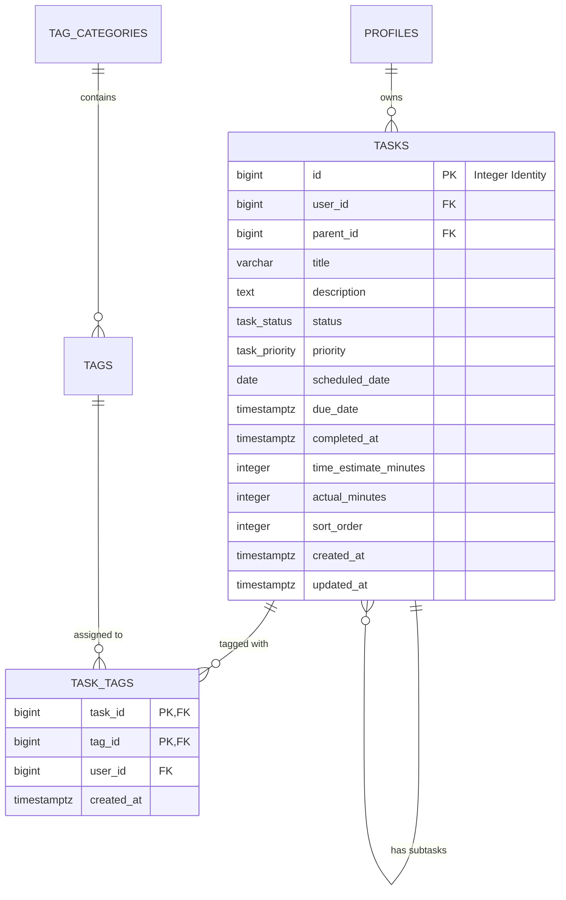

# Data Model: Standalone Task Ledger

## 1. Relational Entity Diagram



---

## 2. PostgreSQL Schema & Types

### 2.1 Enums
```sql
create type public.task_status as enum (
    'todo', 
    'in_progress', 
    'completed', 
    'cancelled', 
    'deferred'
);

create type public.task_priority as enum (
    'low', 
    'normal', 
    'high', 
    'urgent'
);
```

### 2.2 Table Definitions
```sql
create table if not exists public.tasks (
    id bigint generated by default as identity primary key,
    user_id bigint not null references public.profiles(id) on delete cascade,
    parent_id bigint references public.tasks(id) on delete cascade,
    
    -- Content
    title varchar(255) not null,
    description text,
    status public.task_status not null default 'todo',
    priority public.task_priority not null default 'normal',
    
    -- Scheduling & Execution
    scheduled_date date,
    due_date timestamptz,
    completed_at timestamptz,
    
    time_estimate_minutes integer check (time_estimate_minutes is null or time_estimate_minutes >= 0),
    actual_minutes integer check (actual_minutes is null or actual_minutes >= 0),
    sort_order integer not null default 0,
    
    -- Auditing
    created_at timestamptz not null default now(),
    updated_at timestamptz not null default now()
);

create table if not exists public.task_tags (
    task_id bigint not null references public.tasks(id) on delete cascade,
    tag_id bigint not null references public.tags(id) on delete cascade,
    user_id bigint not null references public.profiles(id) on delete cascade,
    created_at timestamptz not null default now(),

    primary key (task_id, tag_id)
);
```

---

## 3. Performance Indexes

```sql
create index if not exists idx_tasks_user_id on public.tasks(user_id);
create index if not exists idx_tasks_parent_id on public.tasks(parent_id);
create index if not exists idx_tasks_user_scheduled on public.tasks(user_id, scheduled_date);
create index if not exists idx_tasks_user_status on public.tasks(user_id, status);
create index if not exists idx_tasks_user_priority on public.tasks(user_id, priority);
create index if not exists idx_tasks_created_at on public.tasks(user_id, created_at desc);

create index if not exists idx_task_tags_tag_id on public.task_tags(tag_id, user_id);
create index if not exists idx_task_tags_user_id on public.task_tags(user_id);
```

---

## 4. Row Level Security (RLS)

Strict single-tenant isolation:
```sql
alter table public.tasks enable row level security;
alter table public.task_tags enable row level security;

-- Tasks Policies
create policy "Users can view own tasks"
    on public.tasks for select
    to authenticated
    using (user_id = (select p.id from public.profiles p where p.auth_user_id = auth.uid()));

create policy "Users can insert own tasks"
    on public.tasks for insert
    to authenticated
    with check (user_id = (select p.id from public.profiles p where p.auth_user_id = auth.uid()));

create policy "Users can update own tasks"
    on public.tasks for update
    to authenticated
    using (user_id = (select p.id from public.profiles p where p.auth_user_id = auth.uid()))
    with check (user_id = (select p.id from public.profiles p where p.auth_user_id = auth.uid()));

create policy "Users can delete own tasks"
    on public.tasks for delete
    to authenticated
    using (user_id = (select p.id from public.profiles p where p.auth_user_id = auth.uid()));

-- Task Tags Policies
create policy "Users can view own task tags"
    on public.task_tags for select
    to authenticated
    using (user_id = (select p.id from public.profiles p where p.auth_user_id = auth.uid()));

create policy "Users can insert own task tags"
    on public.task_tags for insert
    to authenticated
    with check (user_id = (select p.id from public.profiles p where p.auth_user_id = auth.uid()));

create policy "Users can delete own task tags"
    on public.task_tags for delete
    to authenticated
    using (user_id = (select p.id from public.profiles p where p.auth_user_id = auth.uid()));
```
