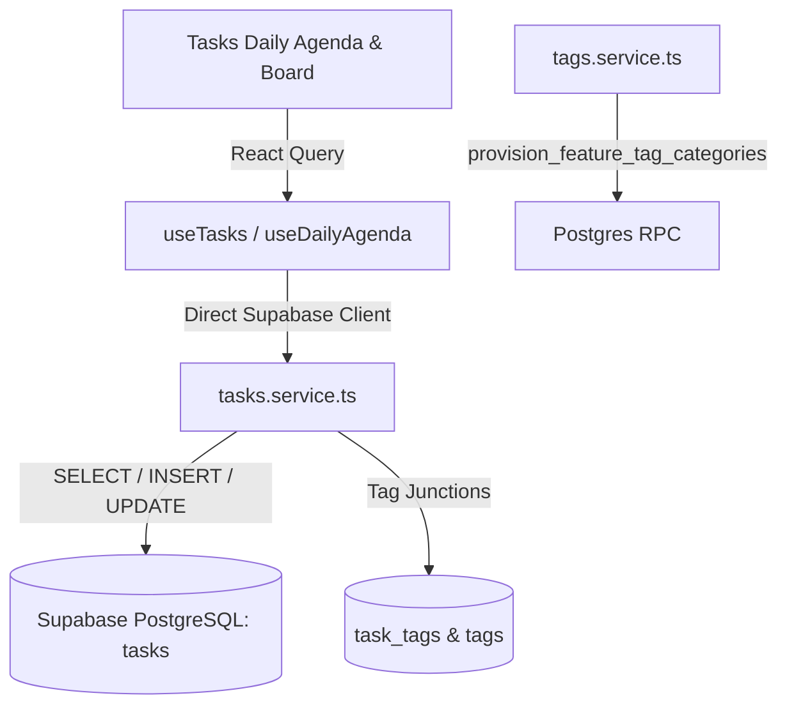

# Technical Design Document (TDD): Task Architecture & Day-to-Day Execution

## 1. System Architecture

---

## 2. Key Architectural Decisions

### 2.1 Complete Separation from Goals
- **Context**: Goals represent high-level, long-term strategic initiatives with complex lifecycle states and hierarchy depths. Tasks represent high-frequency, day-to-day actionable checklists.
- **Decision**: Keep `tasks` completely independent of `goals` to avoid coupling daily operational speed with strategic ledger queries.

### 2.2 Date Primitives: `scheduled_date` vs `due_date`
- `scheduled_date` (`DATE`): Represents the *intention* to do the task on a given day (e.g. today's task list). Queries filtering by `scheduled_date = CURRENT_DATE` are simple date matches without timezone offset complexity.
- `due_date` (`TIMESTAMPTZ`): Represents a hard deadline with an exact time constraint.

### 2.3 Universal Tagging Integration
- Uses the existing Universal Tagging schema with `feature = 'tasks'`.
- Tag categories are provisioned automatically on first use via `provision_feature_tag_categories('tasks')`.
- Default pre-seeded categories:
  1. **Context** (`#3B82F6`): `#Desk`, `#Call`, `#Errand`, `#Terminal`
  2. **Energy & Focus** (`#10B981`): `@DeepFocus`, `@QuickWin`, `@Admin`
  3. **Domain** (`#8B5CF6`): `Work`, `Personal`, `Civic`, `Health`

---

## 3. UI Component Breakdown (< 300 lines per component)

- `src/components/tasks/task-daily-agenda.tsx`: Daily view with tabs for Today, Upcoming, and Unscheduled.
- `src/components/tasks/task-item-card.tsx`: Individual task item with checkbox, tags pill, and priority indicator.
- `src/components/tasks/task-quick-add.tsx`: Inline fast creation bar with date shortcuts.
- `src/components/tasks/task-detail-drawer.tsx`: Side drawer for editing description, subtasks, and time estimates.
- `src/components/tasks/task-tag-combobox.tsx`: Universal tag selector component scoped to `tasks`.
