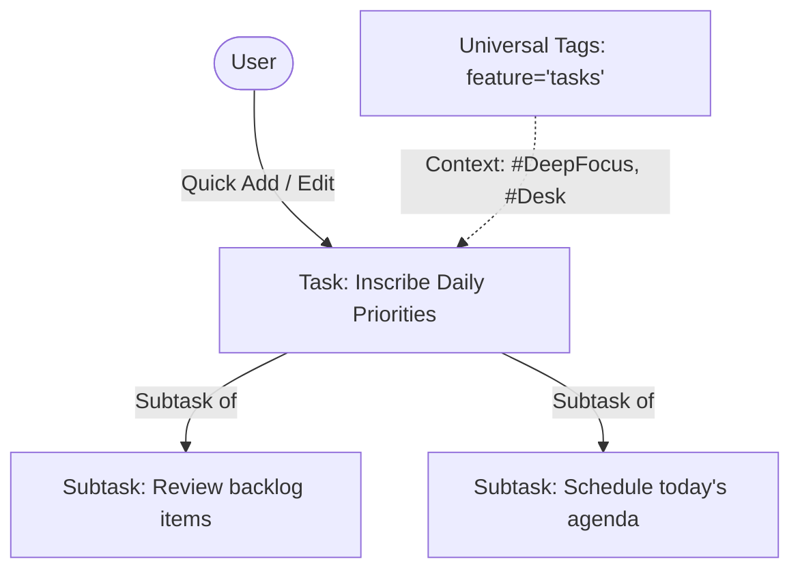
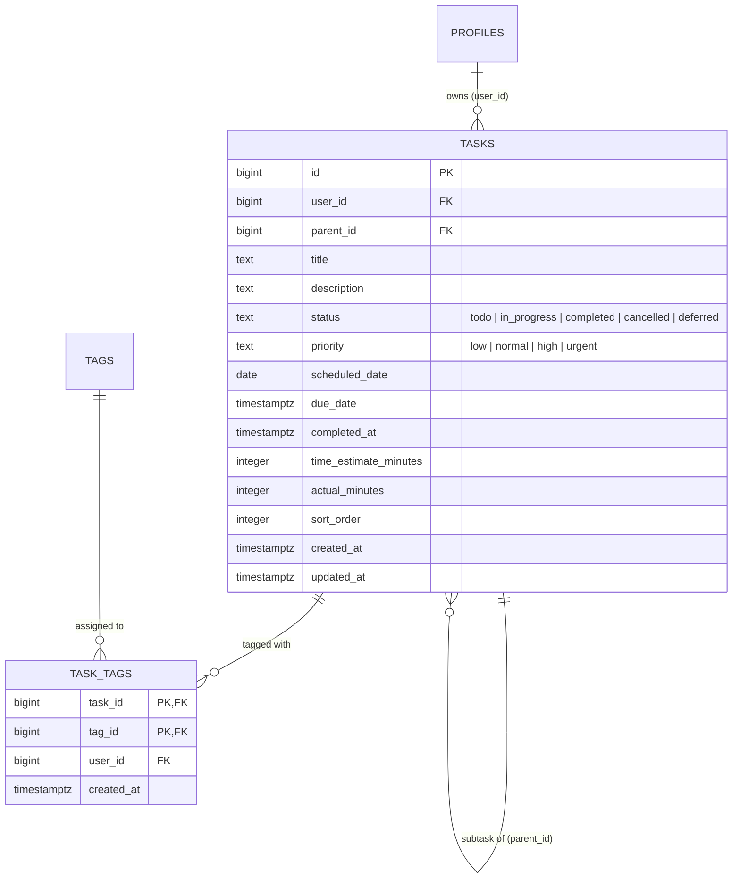

# Feature Spec: Tasks & Daily Execution

> [!NOTE]
> Living feature specification for the Tasks system in The Commons. Automatically rendered at `/dev/document`.

---

## 1. User Story & UX Flow

- **Problem Statement**: Users need a frictionless, high-density task ledger to capture day-to-day actionable tasks, schedule execution for specific days (Today / Upcoming / Backlog), organize subtasks, and tag items by energy/context without strategic bloat.
- **Target Persona**: All authenticated users.

### Primary Interaction Flows:
1. **Quick Creation & Scheduling**:
   - User types a title into the inline quick-add input and hits `Enter`.
   - User assigns a date shortcut (`Today`, `Tomorrow`, custom date, or inbox backlog).
2. **Execution & Checkbox**:
   - One-click completion instantly updates UI optimistically and records `completed_at`.
3. **Subtasks & Details Panel**:
   - Clicking a task opens the side panel (`TaskSidePanel.svelte`) to manage parent/child subtask hierarchy, detailed markdown notes, priorities (`low`, `normal`, `high`, `urgent`), and universal tags.
4. **Universal Tagging & Filtering**:
   - Categorizes tasks with shared tags (`Context`, `Energy`, `Domain`) via `TagManagementSidePanel.svelte`.

---

## 2. Database Schema & RLS Model

- **Primary Entities**: `public.tasks`, `public.task_tags`, `public.tags`, `public.tag_categories`.
- **Identity Key Standard**: `id bigint generated by default as identity primary key`.

### Row Level Security (RLS) Rules:
- All tables enforce strict authenticated user isolation matching `auth.uid() = profiles.auth_user_id`.
- Zero cross-tenant visibility or updates.

---

## 3. Routes & Component Matrix

| Route / Component Path | Type | Responsibility |
| :--- | :--- | :--- |
| `src/routes/(app)/tasks/+page.svelte` | Page View | Main interactive task ledger, list filters, search, and daily views |
| `src/routes/(app)/tasks/+page.server.ts` | Server Loader/Actions | Loads initial tasks & tags for authenticated user |
| `src/lib/components/TaskSidePanel.svelte` | Side Panel | Detailed task editor (subtasks, date picker, priority, tags) |
| `src/lib/components/TagManagementSidePanel.svelte` | Side Panel | Manage category taxonomies and tag assignments |
| `src/lib/types/tags.ts` | Types | TypeScript interfaces for tasks and tags |

---

## 4. Acceptance Criteria & Invariants

- [ ] **Instant Creation**: Pressing Enter in the quick-add input creates and displays the task immediately.
- [ ] **Integer Identity Keys**: All new tasks and tag junctions use `bigint` IDs referencing `public.profiles(id)`.
- [ ] **Multi-Tier Subtask Tree**: Subtasks render nested under their parent with independent completion states.
- [ ] **Tag Cohesion**: Adding or deleting a tag updates the task badges across both the main ledger and side panel.
- [ ] **Zero Cross-User Leakage**: RLS guarantees queries only return tasks owned by the authenticated session.
